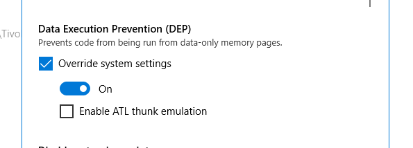
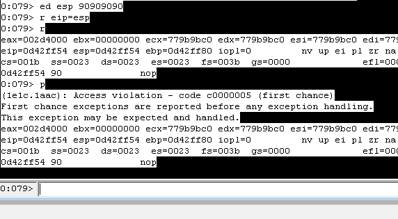

Data Execution Prevention (DEP), simply the CPU makes the .txt part NX i.e Non Executable. We can write data to the memory , but cant execute it.

Enabling DEP....

1. Search :  Windows Defender Security Center
2. Go-to   :   App and Browser Control
3. Scroll Down : Exploit Protection Setting
4. Go-to : Program Setting
5. Add [+] Program to customize , feed the relative path of the binary
6. On Program Setting .... Scroll Down till...



Checkin' it with Windbg...



We just added dummy shellcode of four NOP's to the EIP i.e the current shellcode, then found the access violation...The **Access Violation (c0000005)** error occurs when a program attempts to **read, write, or execute** a memory address it does not have permission to access.


Cool ! Now as an attacker the first thing in mind is how can I bypass this or exploit this. So for that we use Return Oriented Programming (ROP) or Jump Oriented Programming (JOP). JOP is mostly used where we do not have ret. basically when exploiting ARM. 


Vs-Code Regex 

1. push *** ; push *** ; pop *** ; pop *** ; ret [Best]
```
push\s+esp[\s\S]*?pop\s+(esi|eax|ebx|ecx|edi|edx)[\s\S]*?ret
```


2. push *** ; push *** ; pop *** ; mov 
```
push\s+esp[\s\S]*?pop\s+(esi|eax|ebx|ecx|edi|edx)[\s\S]*?pop\s+(esi|eax|ebx|ecx|edi|edx)[\s\S]*?ret
```