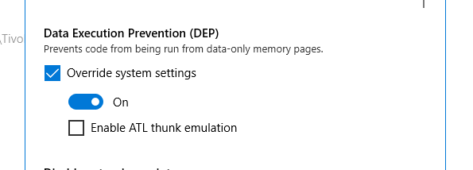
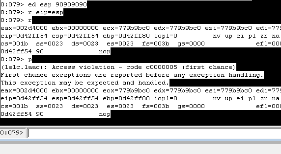

### INTRO_

Data Execution Prevention (DEP), simply the CPU makes the .txt part NX i.e Non Executable. We can write data to the memory , but cant execute it.

Enabling DEP....

1. Search :  Windows Defender Security Center
2. Go-to   :   App and Browser Control
3. Scroll Down : Exploit Protection Setting
4. Go-to : Program Setting
5. Add [+] Program to customize , feed the relative path of the binary
6. On Program Setting .... Scroll Down till...



Checkin' it with Windbg...



We just added dummy shellcode of four NOP's to the EIP i.e the current shellcode, then found the access violation...The **Access Violation (c0000005)** error occurs when a program attempts to **read, write, or execute** a memory address it does not have permission to access.


Cool ! Now as an attacker the first thing in mind is how can I bypass this or exploit this. So for that we use Return Oriented Programming (ROP) or Jump Oriented Programming (JOP). JOP is mostly used where we do not have ret. basically when exploiting ARM. 


### Return Oriented Programming (ROP)

Attack where we use assembly instructions (called gadgets) and API's which are already loaded in the process.

Simply...as DEP is enabled it makes some area non-executable(NX), So we need some way to bypass. There we use ROP, where we use loaded instructions to either allocate executable memory, or changing the permission, or even write the shellcode in (.txt) section to bypass DEP.

First Bypass was ret-2libc (from Linux back in the days), then over the time this exploit's called ROP Chain attack. There are basically two approaches:
1. Build 100% ROP Shellcode (Complex - sans 760)
2. Build ROP chain that leads to executing our shellcode.

We discussin' about the Rop chain.

One way to implement this attack is to allocate memory with write and execute permission and copy our shellcode [Win 32 Virtual Alloc]

OR, Change the permission of the memory page where shellcode already resides. [Virtual Protect]

OR, [Win32 Write Process Memory] - hot patches the code section (.txt) of running process, then injects the shellcode to it. Completely bypass DEP/

ROP Chain is sequence of gadgets  address placed on the stack.

Buffer Overflow ---> Control EIP ---> Execute ROP Chain ---> Call Virtual Protect() ---> Memory Becomes Executable ---> Jumps to the shellcode.


### Finding Gadgets (Small assembly instructions ending with RET)

Why RET ? - RET pops the next address from stack and jumps to it..


We use Rp++ (Open Source Gadgets finder)
1. Copy the executable / dll
2. rp++ -f file.exe/dll -r 5 > rop.txt

Vs-Code Regex 

1. push *** ; push *** ; pop *** ; pop *** ; ret [Best]
```
push\s+esp[\s\S]*?pop\s+(esi|eax|ebx|ecx|edi|edx)[\s\S]*?ret
```


2. push *** ; push *** ; pop *** ; mov 
```
push\s+esp[\s\S]*?pop\s+(esi|eax|ebx|ecx|edi|edx)[\s\S]*?pop\s+(esi|eax|ebx|ecx|edi|edx)[\s\S]*?ret
```

### Preparing the Battle Field

We use [VirtualAlloc](https://learn.microsoft.com/en-us/windows/win32/api/memoryapi/nf-memoryapi-virtualalloc), which can reserve, commit or change the state of a region of pages in virtual address space of a calling process.

LPVOID VirtualAlloc(
  [in, optional] LPVOID lpAddress,          1.
  [in]           SIZE_T dwSize,                          2.
  [in]           DWORD  flAllocationType,    3.
  [in]           DWORD  flProtect                  4.
);

1. memory address
2. size of memory region, dwSize per page basis []
3. mem_commit [0x00001000]
4. Page-Execute-Read-Write [0x00000040]

Now Few Things:
1. We don't know the virtualAlloc address beforehand;
2. We don't know the returnAddress, lpAddress of argument beforehand
3. dwsize, flAllocationType, flProtect contains Null Bytes...

So, we send Dummy Skeleton as inputBuffer and change the values after....


```
va = pack("<L", 0x45454545) # VirtualAlloc addr 
va += pack("<L", 0x46464646) # shellcode return addr 
va += pack("<L", 0x47474747) # lpAddress 
va += pack("<L", 0x48484848) # dwSize 
va += pack("<L", 0x49494949) # flAllocationType 
va += pack("<L", 0x51515151) # flProtect
```

Now update the Proof-Of-Concept : and crash it !

```
> dd esp -1C
0d39e300  45454545 46464646 00000000 48484848
0d39e310  00000000 51515151 42424242 43434343
0d39e320  43434343 43434343 43434343 43434343
0d39e330  43434343 43434343 43434343 43434343
0d39e340  43434343 43434343 43434343 43434343
```

Once the proof of concept is executed, the network packet will trigger the buffer overflow and position the dummy values exactly before the 0x42424242 DWORD that overwrites EIP. The location of the ROP skeleton is correct, but the DWORDs containing 0x47474747 and 0x49494949 were overwritten with null bytes as part of the process to trigger the vulnerability. This won't impact us since we're going to overwrite them again with ROP.


### Making ROP's Acquaintance

Now we need to replace 6 dummy values , Before invoking VirtualAlloc.


### NOTE

To bypass DEP, we just call the Win API's and execute them. In order to call and execute them. ROP - Use existing code (gadgets) to call Windows API's

Overflow 
|
|
Contol EIP ---- First ROP Gadget
|
|
ROP Chain
|
|
Virtual Alloc / Virtual Protect (call windows api's)
|
|
Shellcoed


*CPU Mental Model*
EIP = Current Gadget
ESP = Next Gadget
RET = EIP = [ESP]
ESP += 4

RET always asks ESP for the next gadget

Don't search Gadgets first. Search for the value you need. Then find gadgets to create it.....


